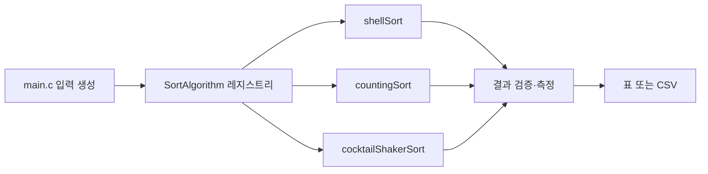

# 정렬 비교 보고서 (셸 · 카운팅 · 칵테일 셰이커)

## 1. 과제 목표

이 과제의 목적은 세 정렬 알고리즘을 같은 입력 생성기와 같은 실행 인터페이스로 구현하고, 결과 배열뿐 아니라 비교 횟수·이동 횟수·실행 시간까지 함께 측정해 알고리즘의 특성을 비교하는 것이다. 보고서의 그래프는 `make charts`가 생성하는 `report/results.csv`를 바탕으로 갱신할 수 있으며, SVG 파일로 저장되어 별도의 이미지 라이브러리 없이 Markdown에서 바로 표시된다.

- 저장소: [2026193116/Compare-Sorting](https://github.com/2026193116/Compare-Sorting)
- 실행: `make test`, `make run`, `make charts`
- C 컴파일: `gcc -std=c17 -Wall -Wextra -O2`
- 비교 대상: 셸 정렬, 카운팅 정렬, 칵테일 셰이커 정렬

시간은 운영체제와 현재 부하의 영향을 받으므로 절대 시간 하나만으로 우열을 단정하지 않는다. 같은 환경에서 반복해 얻은 비교·이동 횟수와 입력 형태별 경향을 함께 해석한다.

## 2. 구현 구조와 실험 인터페이스

알고리즘을 작성하기 전에 모든 구현이 같은 방식으로 호출되도록 인터페이스를 먼저 만들었다. C에서는 `SortFunction` 함수 포인터를 사용한다. 각 정렬 함수는 정수 배열, 원소 수, 통계 구조체의 주소를 받고 배열 자체를 정렬한다.



| 파일 | 알고리즘과 직접 관련된 역할 | 비교 실험·공통 기반에서의 역할 |
| --- | --- | --- |
| `src/sortctx.h` | 없음 | `SortStats`와 `SortFunction`이라는 공통 호출 규약 정의 |
| `src/sort.h` | 정렬 함수 선언 | `SortAlgorithm` 메타데이터와 레지스트리 선언 |
| `src/sort.c` | 없음 | 이름·복잡도·안정성·함수 포인터를 한 목록으로 관리 |
| `src/shellSort.c` | 셸 정렬 구현 | 공통 통계를 기록 |
| `src/countingSort.c` | 카운팅 정렬 구현 | 공통 통계를 기록 |
| `src/cocktailShakerSort.c` | 칵테일 셰이커 정렬 구현 | 공통 통계를 기록 |
| `src/main.c` | 없음 | 입력 생성, 복사, 시간 측정, 정렬 결과 검증, CSV 출력 |
| `tests/test_sort.c` | 없음 | 프레임워크 없이 모든 구현의 경계 조건을 공통 검사 |
| `src/sort.py` | 없음 | Python 함수들을 하나의 레지스트리로 공개 |
| `tools/plot.py` | 없음 | CSV를 읽어 보고서용 SVG 그래프 생성 |
| `Makefile` | 없음 | 빌드·테스트·실험·그래프 생성 명령의 단일 진입점 |

`sort.c`에 레지스트리를 둔 덕분에 `main.c`는 알고리즘 이름을 하나씩 호출하지 않는다. 새 알고리즘을 추가할 때 구현 파일과 레지스트리 항목을 추가하면 동일한 실험에 참여할 수 있다. `sortctx.h`의 통계 구조체도 알고리즘이 결과를 반환하는 방식과 측정 방법을 분리한다. `main.c`는 입력을 보존하기 위해 작업 배열을 매번 복사하고, 정렬 뒤 `is_sorted`로 결과를 검증한다.

`Makefile`의 `run`은 사람이 읽는 표를, `--csv`는 그래프가 읽는 구조화된 데이터를 만든다. `--blocks`는 `n = 128, 256, 512, 1024, 2048`로 바꾸어 입력 크기 증가 실험을 수행한다. C 테스트와 Python 테스트는 빈 배열, 한 원소, 중복, 음수, 역순을 검사한다.

## 3. C와 Python 구현의 공통점과 차이점

### 3.1 공통점

두 언어의 세 함수는 모두 입력을 오름차순으로 정렬한다. 원본을 직접 바꾸지 않는 Python 함수와 달리 C 함수는 작업 배열을 받지만, 실험 프로그램이 원본을 복사한 뒤 넘기므로 알고리즘 비교 조건은 동일하다. 세 알고리즘의 핵심 단계도 같다.

- 셸 정렬: Knuth 간격 수열을 큰 간격에서 1까지 줄이며 간격별 삽입 정렬을 수행한다.
- 카운팅 정렬: 최솟값을 기준으로 빈도 배열의 인덱스를 이동해 음수를 포함한 정수를 센다.
- 칵테일 셰이커 정렬: 왼쪽→오른쪽, 오른쪽→왼쪽 패스를 반복하고 양쪽 경계를 줄인다.
- 정렬 함수 자체와 레지스트리를 분리하여 호출부가 개별 구현의 내부를 알지 않아도 되게 했다.

### 3.2 차이점

| 항목 | C 구현 | Python 구현 |
| --- | --- | --- |
| 파일·이름 규칙 | `shellSort.c`, `countingSort.c`, `cocktailShakerSort.c`와 camelCase 함수 | `shell_sort.py`, `counting_sort.py`, `cocktail_shaker_sort.py`와 snake_case 함수 |
| 자료 구조 | `int` 배열을 제자리에서 수정 | `list(values)`로 복사한 뒤 새 리스트를 반환 |
| 통계 | `SortStats` 포인터로 비교·이동 횟수를 ��접 누적 | 반환값 중심의 간단한 공개 API이며 현재 통계 구조체는 사용하지 않음 |
| 메모리 관리 | 카운팅 정렬의 `count`, `output`을 `calloc`·`malloc`·`free`로 관리 | 리스트와 Python 객체 수명은 런타임이 관리 |
| 호출 구조 | `SortAlgorithm` 배열과 함수 포인터를 C 링크 단계에서 결합 | `SORT_ALGORITHMS` 리스트에 `(이름, 함수)` 튜플을 등록 |
| 오류·타입 | 컴파일러가 포인터·정수 타입을 검사하며 할당 실패를 확인 | 동적 타입이며 입력은 반복 가능한 값으로 처리 |
| 성능 측정 | `clock()`으로 함수 실행 시간을 직접 측정 | 이 저장소의 정량 CSV 실험은 C 경로를 사용 |

따라서 두 구현은 알고리즘을 설명하고 결과를 확인하는 교육용 쌍으로는 대응하지만, 언어 런타임과 메모리 모델이 다르므로 C와 Python의 밀리초 값을 직접 비교해서는 안 된다. Python 쪽의 `list(values)`는 호출자 입력을 보호하는 장점이 있고, C 쪽의 제자리 처리는 메모리와 실행 비용을 더 명시적으로 통제할 수 있다는 차이가 있다.

## 4. 알고리즘별 원리와 장점·한계

### 4.1 셸 정렬

셸 정렬은 배열 전체에 삽입 정렬을 한 번만 적용하지 않고, 일정한 `gap` 간격의 부분 배열을 먼저 정렬한다. 구현은 Knuth 수열 `1, 4, 13, ...`을 큰 값부터 역순으로 적용하고 마지막에 `gap = 1`인 삽입 정렬로 마무리한다.

- **장점:** 추가 배열 없이 동작하고, 멀리 떨어진 역순을 먼저 줄여 단순한 삽입 정렬보다 보통 빠르다. 값의 범위에 의존하지 않아 정수 범위가 넓어도 사용할 수 있다.
- **한계:** 성능의 정확한 복잡도가 간격 수열에 의존한다. 간격이 다른 원소를 건너뛰어 이동시키므로 일반적인 구현은 안정적이지 않다.
- **복잡도:** 추가 공간 `O(1)`, 시간은 선택한 gap 수열에 따라 달라진다.

### 4.2 카운팅 정렬

최솟값과 최댓값을 구하고 `max - min + 1` 크기의 빈도 배열을 만든다. 각 값의 빈도를 누적한 뒤 뒤에서부터 output에 배치하여 안정성을 유지하고, 결과를 원래 배열에 복사한다.

- **장점:** 비교를 거의 하지 않고 값의 범위가 작은 정수 입력에서는 `O(n + k)`로 매우 빠르다. 현재 구현은 뒤에서부터 배치하므로 같은 키의 순서를 보존하는 안정 구현으로 확장하기 쉽다.
- **한계:** `k = max - min + 1`가 커지면 입력 원소 수보다 훨씬 큰 메모리와 초기화 시간이 필요하다. 정수가 아닌 일반 객체나 비교 함수 기반 자료에는 바로 적용하기 어렵다.
- **복잡도:** 시간 `O(n + k)`, 추가 공간 `O(n + k)`.

### 4.3 칵테일 셰이커 정렬

정방향 패스에서 큰 값을 오른쪽으로 보내고, 역방향 패스에서 작은 값을 왼쪽으로 보낸다. 매 라운드 양쪽 경계를 한 칸씩 줄이며, 교환이 전혀 없으면 조기 종료한다.

- **장점:** 구현이 단순하고 제자리에서 동작한다. 거의 정렬된 입력에서는 조기 종료가 가능하며, 같은 값에 대해 교환하지 않으므로 안정적이다. 한 방향 버블 정렬보다 양 끝의 어긋남을 동시에 처리한다.
- **한계:** 역순·무작위 입력에서는 인접 교환이 반복되어 큰 입력에 부적합하다. 비교 기반 정렬이므로 카운팅 정렬처럼 값 범위가 좁다는 이점을 활용하지 못한다.
- **복잡도:** 최선 `O(n)`, 평균·최악 `O(n²)`, 추가 공간 `O(1)`.

## 5. 실험 방법과 시각화

`main.c`는 `random`, `sorted`, `reverse`, `duplicates` 네 입력을 각각 `n = 2000`으로 만든다. 난수 대신 고정 산술식을 사용하여 실행마다 같은 입력을 재현한다. 각 알고리즘에 대해 원본 복사, 정렬, `comparisons`, `moves`, `time_ms`, 결과 검증 여부를 기록한다.

```text
make test
python3 tests/test_sort.py
make run
make charts
```

`make charts`는 다음 순서로 동작한다.

1. `src/main.out --csv`의 출력으로 `report/results.csv`를 갱신한다.
2. `tools/plot.py`가 CSV를 읽는다.
3. 정적 SVG를 `report/`에 저장한다.

보고서에 포함되는 SVG 자료는 모두 저장소의 `report/` 폴더에 별도 파일로 둔다.

### 이론적 복잡도


### 입력 형태에 따른 실행 시간


### 입력 형태에 따른 비교 횟수


### 입력 형태에 따른 이동 횟수


### 입력 크기 증가에 따른 시간 변화


그래프의 시간 값은 실행 환경에 따라 변하므로 재현된 특정 숫자보다 곡선의 방향과 알고리즘별 상대 차이를 본다. 특히 카운팅 정렬은 값의 범위가 작은 `duplicates` 입력에서 유리할 수 있지만, 그래프의 비교 횟수만 보면 빈도 기반 처리 특성 때문에 셸·칵테일과 직접 같은 의미로 해석할 수 없다. 이동 횟수 역시 C 구현에서 대입을 세는 기준에 따른 지표다.

## 6. 결과 해석

| 알고리즘 | 최선 | 평균 | 최악 | 추가 공간 | 안정성 |
| --- | --- | --- | --- | --- | --- |
| 셸 정렬 | gap에 따라 다름 | gap에 따라 다름 | gap에 따라 다름 | `O(1)` | 아니오 |
| 카운팅 정렬 | `O(n+k)` | `O(n+k)` | `O(n+k)` | `O(n+k)` | 예(현재 구현 방식) |
| 칵테일 셰이커 | `O(n)` | `O(n²)` | `O(n²)` | `O(1)` | 예 |

입력 크기가 커질수록 칵테일 셰이커의 이차적 증가가 가장 뚜렷해질 것으로 예상된다. 셸 정렬은 gap 수열과 입력 분포에 따라 그보다 완만하게 증가하고, 카운팅 정렬은 `n`뿐 아니라 값의 범위 `k`가 결과를 결정한다. 따라서 “항상 가장 빠른 정렬”을 고르기보다 `n`, `k`, 입력의 정렬 상태, 안정성 요구, 사용 가능한 메모리를 함께 고려해야 한다.

## 7. 결론

이번 구현은 알고리즘 코드뿐 아니라 공통 인터페이스, 레지스트리, 입력 생성기, 결과 검증기, 통계 수집기, CSV 출력기, 그래프 생성기를 함께 구성했다. 이 분리를 통해 알고리즘의 정확성과 실험 기반을 독립적으로 확인할 수 있었다. 셸 정렬은 메모리를 적게 쓰는 범용적인 선택이고, 카운팅 정렬은 작은 정수 범위에서 강력하며, 칵테일 셰이커 정렬은 교육적으로 단순하고 거의 정렬된 작은 입력에서 의미가 있다.

## 참고 자료

1. [Wikipedia — Sorting algorithm](https://en.wikipedia.org/wiki/Sorting_algorithm)
2. [Wikipedia — Shellsort](https://en.wikipedia.org/wiki/Shellsort)
3. [Wikipedia — Counting sort](https://en.wikipedia.org/wiki/Counting_sort)
4. [Wikipedia — Cocktail shaker sort](https://en.wikipedia.org/wiki/Cocktail_shaker_sort)
5. [강의 실습 template](https://github.com/lec-algorithm/hw1-sample-2026)
