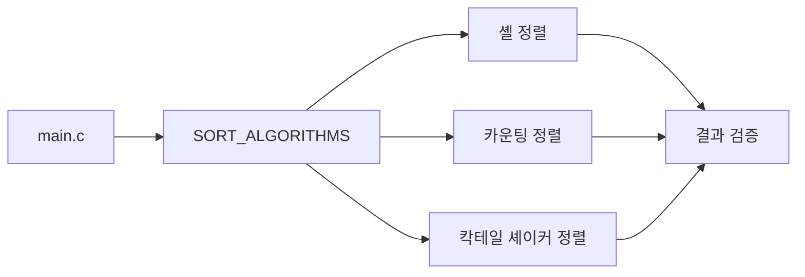
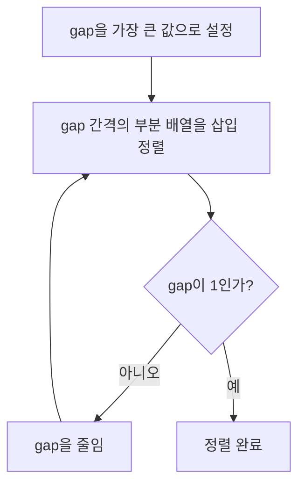
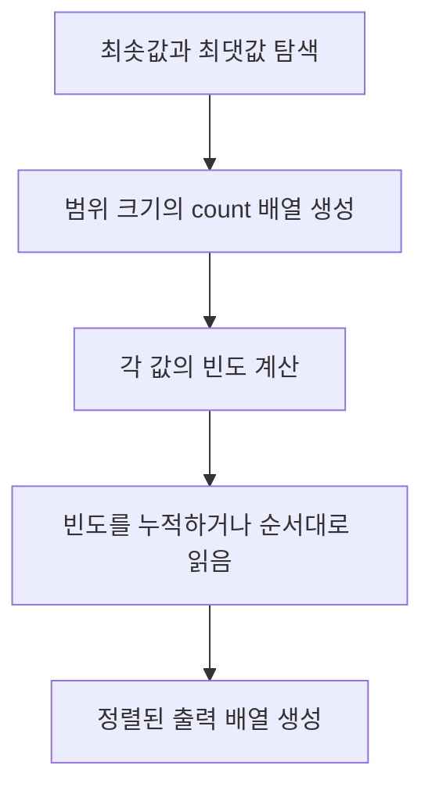
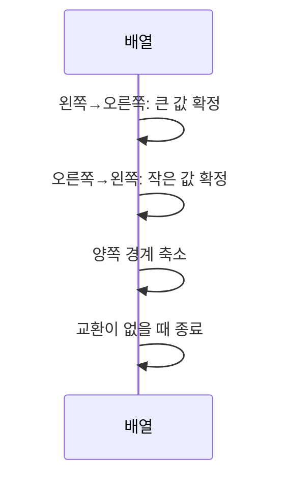

# 정렬 비교 보고서 (셸 · 카운팅 · 칵테일 셰이커)

## 1. 과제 목표

이 과제에서는 정렬 알고리즘 세 가지를 같은 프로그램과 입력 조건에서 실행하고, 동작 원리·복잡도·메모리 사용량·안정성·입력 특성에 따른 차이를 비교하였다. 선택한 알고리즘은 배운 정렬인 **셸 정렬**, **카운팅 정렬**, 배우지 않은 정렬인 **칵테일 셰이커 정렬**이다.

- 코드 저장소: [2026193116/Compare-Sorting](https://github.com/2026193116/Compare-Sorting)
- 실행: `make test`, `make run`, `make charts`
- 컴파일 조건: `gcc -std=c17 -Wall -Wextra -O2`

## 2. 구현 설계

세 알고리즘은 `SortFunction`이라는 동일한 함수 포인터 형식을 사용한다. 입력 배열의 주소, 원소 수, 비교·이동 통계를 전달하므로 `main.c`는 알고리즘의 내부 구현을 알 필요가 없다. `SORT_ALGORITHMS` 표에 구현을 등록하면 실행·검증·출력에서 자동으로 같은 처리를 받는다.



| 파일 | 역할 |
| --- | --- |
| `src/sort.h` | 공통 함수 형식과 통계 구조체 선언 |
| `src/shellSort.c` | gap을 이용한 삽입 정렬 구현 |
| `src/countingSort.c` | 값의 빈도 배열을 이용한 정렬 구현 |
| `src/cocktailShakerSort.c` | 양방향 버블 정렬 구현 |
| `src/main.c` | 네 가지 입력과 측정 결과 출력 |
| `tests/test_sort.c` | 외부 프레임워크 없는 C 테스트 |
| `src/sort.py` | 같은 세 알고리즘의 Python 구현 |
| `tools/plot.py` | 외부 라이브러리 없이 SVG 생성 |

## 3. 알고리즘 원리

### 3.1 셸 정렬

셸 정렬은 삽입 정렬을 여러 간격(`gap`)에 대해 수행하는 방법이다. 처음에는 멀리 떨어진 원소를 비교하여 큰 어긋남을 빠르게 줄이고, 마지막에 `gap = 1`인 일반 삽입 정렬로 마무리한다. 이 구현은 Knuth 수열 `1, 4, 13, ...`을 역순으로 사용한다.



장점은 추가 배열 없이 멀리 있는 역순을 먼저 고친다는 점이다. 단점은 정확한 시간 복잡도가 gap 수열에 의존하고, 같은 값의 상대 순서를 보장하지 않는다는 점이다. 최악 복잡도는 사용한 수열에 따라 달라지므로 보고서에서는 단일 숫자로 과장하지 않고 `gap-dependent`로 기록하였다.

### 3.2 카운팅 정렬

카운팅 정렬은 원소를 서로 직접 비교하지 않고 각 정수가 몇 번 나타나는지를 센다. 음수가 있을 수 있으므로 최솟값을 기준점으로 옮겨 `count[value - min]`을 사용하였다.



시간 복잡도는 `O(n + k)`, 공간 복잡도는 `O(n + k)`이다. 여기서 `k = max - min + 1`이다. `[-8, 7]`처럼 범위가 작으면 매우 효율적이지만, `1`과 `1,000,000,000`만 있는 입력처럼 범위가 크면 count 배열이 비효율적이다. 현재 C 구현은 정수 배열을 정렬하는 데 초점을 두며, Python 구현은 빈도만큼 결과를 순서대로 추가한다.

### 3.3 칵테일 셰이커 정렬 — AI 학습 내용

칵테일 셰이커 정렬은 버블 정렬을 한 방향으로만 반복하지 않고 **왼쪽에서 오른쪽으로 한 번**, 이어서 **오른쪽에서 왼쪽으로 한 번** 훑는 양방향 버블 정렬이다. Wikipedia의 sorting algorithm 비교표에서 cocktail shaker sort로 소개되는 알고리즘을 참고해 구현하였다.

한 번의 정방향 패스는 현재 구간의 최댓값을 오른쪽 끝에 보낸다. 역방향 패스는 최솟값을 왼쪽 끝에 보낸다. 그러므로 각 라운드 뒤에 양쪽 경계가 모두 줄어든다.



최악 시간 복잡도는 `O(n²)`, 이미 정렬된 경우 조기 종료로 `O(n)`, 추가 공간은 `O(1)`이다. 인접한 원소가 같을 때 교환하지 않으므로 안정적이다. 셸 정렬과 달리 배우지 않은 알고리즘이므로, 이 부분은 AI 설명을 그대로 받아들이기보다 의사코드와 테스트로 동작을 확인했다.

## 4. 실험 방법

C 프로그램은 `n = 2000` 배열에 대해 `random`, `sorted`, `reverse`, `many-duplicates` 네 입력을 만든다. 난수 대신 고정된 산술식으로 입력을 만들었기 때문에 실행마다 동일한 배열이 생성된다. 각 알고리즘에 대해 원본을 작업 배열로 복사한 뒤 정렬 시간, 비교 횟수, 이동 횟수를 기록하고 결과가 오름차순인지 검사한다. 카운팅 정렬은 비교 기반 알고리즘이 아니므로 비교 횟수가 매우 작거나 0으로 나타나는 것이 정상이다.

```text
make test       # C 테스트
python3 tests/test_sort.py
make run        # 표 출력
make charts     # CSV 및 SVG 갱신
```

시간은 컴퓨터 부하와 컴파일러에 영향을 받으므로 절대값보다 같은 환경에서의 상대 비교와 연산 횟수를 중심으로 해석해야 한다. `report/results.csv`는 `make charts`를 실행한 환경의 실측 결과이며, 그래프는 외부 패키지 없이 Python 표준 모듈로 생성된다.

## 5. 결과 해석

### 이론적 비교

| 알고리즘 | 최선 | 평균 | 최악 | 추가 공간 | 안정성 |
| --- | --- | --- | --- | --- | --- |
| 셸 정렬 | gap에 따라 다름 | gap에 따라 다름 | gap에 따라 다름 | `O(1)` | 불안정 |
| 카운팅 정렬 | `O(n+k)` | `O(n+k)` | `O(n+k)` | `O(n+k)` | 안정 구현 가능 |
| 칵테일 셰이커 | `O(n)` | `O(n²)` | `O(n²)` | `O(1)` | 안정 |


셸 정렬은 세 알고리즘 중 메모리를 가장 적게 사용하면서 단순한 `O(n²)` 정렬보다 보통 빠르다. 카운팅 정렬은 값의 범위가 입력 크기에 비해 작을 때 가장 유리하다. 반대로 범위가 커지면 `k` 때문에 공간과 초기화 시간이 증가한다. 칵테일 셰이커 정렬은 이미 정렬되었거나 거의 정렬된 배열에서는 조기 종료의 이점이 있지만, 무작위·역순 입력에서는 이차 시간이 지배적이다.


### 결과 검증

테스트는 빈 배열, 원소 하나, 중복, 음수, 역순 배열을 모든 알고리즘에 적용한다. 정렬 결과는 직접 작성한 기대 배열과 비교한다. 또한 `make run`은 실행 후 배열이 실제로 오름차순인지 `isSorted`로 다시 확인한다. 따라서 시간 측정이 빠르더라도 정렬을 하지 않은 구현이 통과할 수 없다.

## 6. 결론

세 정렬은 서로 다른 상황에서 의미가 있다. 정수 값의 범위가 작다는 조건을 알고 있다면 카운팅 정렬이 가장 강력하다. 범위가 크거나 추가 메모리를 거의 사용할 수 없다면 셸 정렬이 현실적인 절충안이다. 칵테일 셰이커 정렬은 일반적인 대규모 정렬에는 적합하지 않지만, 양방향으로 문제를 줄이고 거의 정렬된 데이터에서 조기 종료하는 구조를 이해하기 좋은 알고리즘이다.

이번 비교에서 중요한 점은 “항상 가장 빠른 정렬”이 하나 있는 것이 아니라 입력의 크기 `n`, 값의 범위 `k`, 정렬 상태, 메모리 제한을 함께 고려해야 한다는 것이다.

## 참고 자료

1. [Wikipedia — Sorting algorithm, Comparison of algorithms](https://en.wikipedia.org/wiki/Sorting_algorithm#Comparison_of_algorithms)
2. [Wikipedia — Shellsort](https://en.wikipedia.org/wiki/Shellsort)
3. [Wikipedia — Counting sort](https://en.wikipedia.org/wiki/Counting_sort)
4. [Wikipedia — Cocktail shaker sort](https://en.wikipedia.org/wiki/Cocktail_shaker_sort)
5. [강의 실습 template](https://github.com/lec-algorithm/hw1-sample-2026)
