# 정렬 비교 보고서 (셸 · 카운팅 · 칵테일 셰이커)

## 1. 과제 개요

이번 과제를 통해 셸 정렬, 카운팅 정렬, 칵테일 셰이커 정렬, 총 세 개의 정렬 알고리즘을 C언어와 파이썬, 총 2개의 언어를 바탕으로 공통된 인터페이스와 실험 기준을 공유하며 비교한다. 각 알고리즘은 동일한 입력 패턴, 동일한 검증 기준, 동일한 출력 포맷을 기준으로 평가되며, 단순한 실행 속도만 보지 않고 알고리즘의 동작 방식과 구조적 차이까지 함께 살핀다.

- 비교 대상: 셸 정렬, 카운팅 정렬, 칵테일 셰이커 정렬
- 공통 조건: 오름차순 정렬, 동일한 입력 생성기, 동일한 측정 루틴, 동일한 출력 포맷
- 핵심 질문:
  - 어떤 입력에서 빠른가?
  - 어떤 입력에서 비교·교환이 많아지는가?
  - 안정성, 추가 메모리, 구현 난이도는 어떤 차이가 있는가?

이번 과제를 통해 C언어와 파이썬을 활용하여 코드를 작성하고, 정렬 함수의 작동이 제대로 되는지를 확인하는 것보다, 전체적으로 알고리즘의 진행 방식과 성능 특성을 이해하는 데 집중한다.

---

## 2. 구현 구조와 실험 인터페이스

### 2.1 전체 설계 의도

입력 생성 방식, 시간 측정 방식, 통계 집계 방식이 조금만 달라도 결과가 서로 다르게 보이기 때문에 세 알고리즘을 각각 따로 구현하는 것만으로는 공정한 비교가 어렵다. 그래서 본 실험은 가능한 한 모든 구현이 같은 입력, 같은 측정 포인트, 같은 출력 규칙을 따라 동작하도록 설계되었다.

C 구현에서는 `SortFunction` 함수 포인터와 `SortStats` 구조체를 사용해 각 알고리즘을 공통 기준으로 호출한다. 함수가 받는 인자는 정렬 대상 배열, 배열 길이, 통계 구조체 포인터다. 이를 통해 비교 횟수, 이동 횟수, 실행 시간을 동일한 기준으로 누적할 수 있다.

```c
/* 개념적인 인터페이스 예시 */
typedef struct SortStats {
    long long comparisons;
    long long moves;
    double elapsed_ms;
} SortStats;

typedef void (*SortFunction)(int *arr, int n, SortStats *stats);
```

이 구조는 대부분의 정렬 실험에서 중요한 점을 보장한다.

1. 같은 입력 조건으로 모든 알고리즘을 시험한다.
2. 비교 횟수와 이동 횟수를 동일한 기준으로 기록한다.
3. 시간 측정이 구현마다 달라지지 않는다.
4. 알고리즘을 추가해도 측정 코드와 테스트 코드를 크게 바꾸지 않아도 된다.

Python 구현도 같은 원리를 따른다. `src/main.py`는 입력 생성과 시간 측정, `src/sort.py`는 알고리즘 레지스트리, 각 개별 `*_sort.py` 파일은 알고리즘 구현을 담당한다. 이렇게 하면 C와 Python 사이의 실험 절차가 일관되며, 같은 입력 값으로 같은 검증 기준을 적용할 수 있다.

```python
"""Run every Python sorting implementation in src."""

import argparse
import random
import time

from sort import SORT_ALGORITHMS


def make_input(size, kind):
    if kind == "sorted":
        return list(range(size))
    if kind == "reverse":
        return list(range(size, 0, -1))
    if kind == "duplicates":
        return [(index * 7 + 3) % 21 - 10 for index in range(size)]
    random.seed(2026 + size)
    return [random.randrange(-500, 500) for _ in range(size)]


def run_case(name, values, csv):
    expected = sorted(values)
    for algorithm_name, algorithm in SORT_ALGORITHMS:
        start = time.perf_counter()
        result = algorithm(values)
        elapsed = (time.perf_counter() - start) * 1000
        valid = result == expected
        if csv:
            print(f"{algorithm_name},{name},{len(values)},,,{elapsed:.3f},{str(valid).lower()}")
        else:
            print(
                f"{algorithm_name:20} {name:12} {len(values):8} "
                f"{elapsed:10.3f} {'yes' if valid else 'NO'}"
            )


def main():
    parser = argparse.ArgumentParser()
    parser.add_argument("--csv", action="store_true")
    parser.add_argument("--blocks", action="store_true")
    args = parser.parse_args()

    csv = args.csv or args.blocks
    if csv:
        print("algorithm,input,n,comparisons,moves,time_ms,valid")
    else:
        print("=== sorting comparison ===")
        print(f"{'algorithm':20} {'input':12} {'n':8} {'time(ms)':10} valid")

    if args.blocks:
        for size in (128, 256, 512, 1024, 2048):
            run_case("block", make_input(size, "random"), True)
    else:
        for name in ("random", "sorted", "reverse", "duplicates"):
            run_case(name, make_input(2000, name), csv)


if __name__ == "__main__":
    main()
```


### 2.2 파일 구성

| 파일 | 역할 |
| --- | --- |
| `src/sortctx.h` | 정렬 구현에서 공통으로 쓰는 컨텍스트와 유틸 함수 정의 |
| `src/sort.h` | `SortAlgorithm`, `SortStats`, 함수 포인터 선언 |
| `src/sort.c` | 알고리즘 레지스트리와 공통 메타데이터 제공 |
| `src/shellSort.c` | 셸 정렬 C 구현 |
| `src/countingSort.c` | 카운팅 정렬 C 구현 |
| `src/cocktailShakerSort.c` | 칵테일 셰이커 정렬 C 구현 |
| `src/main.c` | 입력 생성, 복사, 시간 측정, 검증, CSV 및 표 출력 |
| `src/sort.py` | Python 알고리즘 레지스트리 및 공개 API |
| `src/shell_sort.py` | 셸 정렬 Python 구현 |
| `src/counting_sort.py` | 카운팅 정렬 Python 구현 |
| `src/cocktail_shaker_sort.py` | 칵테일 셰이커 정렬 Python 구현 |
| `src/main.py` | 입력 생성, 시간 측정, 검증, CSV/표준 출력 실행 |
| `tests/test_sort.c` | 경계 조건과 결과 검증 |
| `tools/plot.py` | CSV를 읽어 SVG 그래프 생성 |

### 2.3 구조도

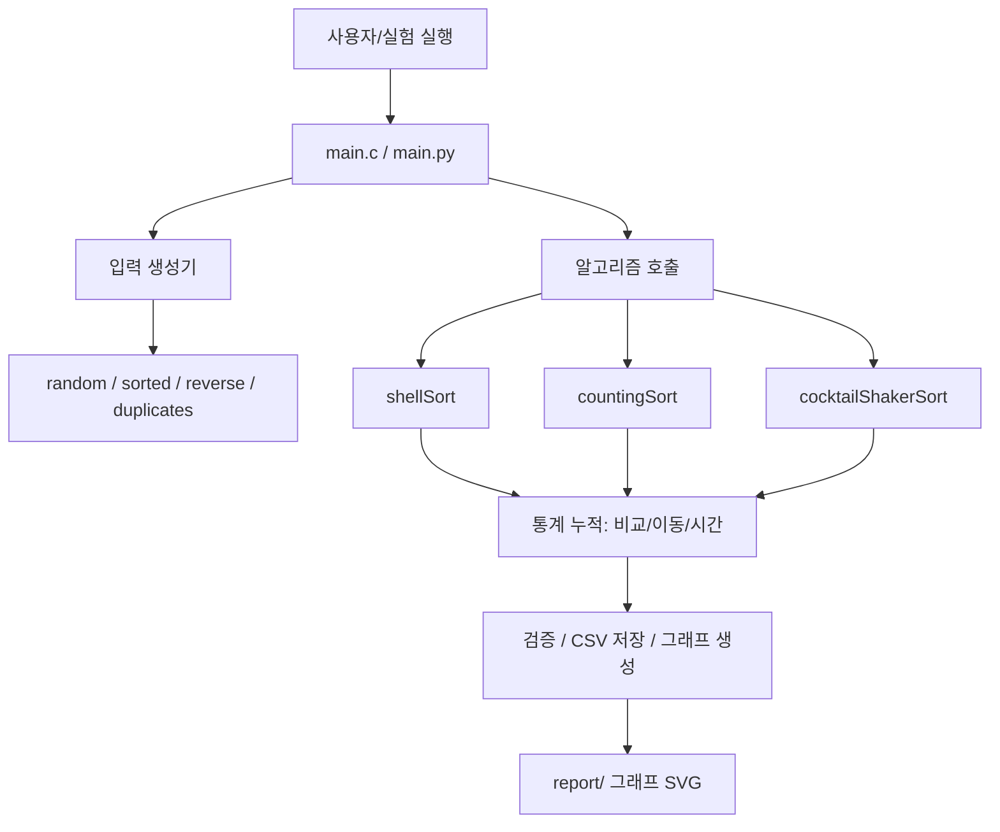

파이썬 구조도는 C 구조와 거의 같은 흐름을 따른다. `src/main.py`는 입력을 만들고 각 알고리즘을 호출해 정렬 결과와 실행 시간을 측정하며, `src/sort.py`는 알고리즘 등록 목록을 제공한다. 즉, C의 함수 포인터 체계와 유사하게 Python에서도 각 정렬 함수가 공통된 호출 인터페이스를 가지고 있어, 문맥을 바꾸지 않고 동일한 실험 루틴을 재사용할 수 있다.

Mermaid 구조도와 함께 C 구현 파일 사이의 의존 관계를 구체적으로 나타내면 다음과 같다.

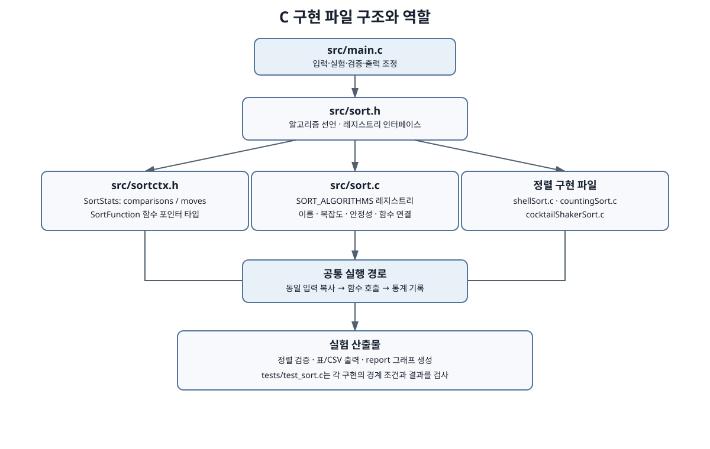

### 2.4 실험 흐름 순서도

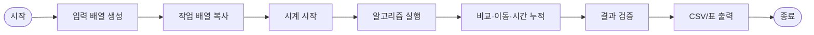

### 2.5 입력 생성 방식

실험에서는 네 가지 입력 패턴을 사용한다.

- `random`: 무작위 배열
- `sorted`: 이미 정렬된 배열
- `reverse`: 역순 배열
- `duplicates`: 중복 값이 많은 배열

이 네 종류는 단일 정렬 알고리즘의 좋은 경우와 나쁜 경우가 각각 무엇인지 확인하는 데 매우 중요하다. 예를 들어 셸 정렬은 정렬된 배열에서 매우 빠르게 정리되지만, 역순 배열에서는 간격 이동이 많아질 수 있다. 반대로 카운팅 정렬은 범위가 제한된 입력에서는 강력하지만, 값의 범위가 넓으면 오히려 메모리를 많이 소모한다.

---

## 3. 알고리즘별 원리와 코드 설명

### 3.1 셸 정렬

셸 정렬은 삽입 정렬을 단일 배열 전체에 적용하는 대신, 일정한 간격(gap)을 두고 부분 배열을 정렬하면서 점점 간격을 줄여가는 방식이다. 이 구현은 비교적 단순하면서도 큰 배열에서 삽입 정렬보다 훨씬 유연하게 동작하도록 설계되었다.

핵심 아이디어는 “큰 값이 멀리 떨어진 곳에 있으면 큰 간격으로 먼저 정리하고, 점점 세밀하게 다듬는다”는 점이다. 이 방식은 단순 삽입 정렬보다 더 빠르게 큰 값들을 이동시키고, 점차 정렬 범위를 줄여 최종적으로 전체 배열을 정렬한다.

#### Python 구현 관점의 설명

파이썬 버전의 셸 정렬은 `src/shell_sort.py`에 위치하며, C 구현과 동일하게 큰 간격부터 시작해 점차 gap을 줄여 나가는 구조를 사용한다. Python에서는 리스트 인덱싱과 슬라이싱을 이용해 배열을 직접 수정하고, 내부 `while` 루프로 간격에 맞춰 원소를 이동시킨다. C 코드와 비교하면 반복 구조는 동일하지만, 메모리 안전성과 포인터 사용이 아니라 Python의 리스트와 인덱싱 방식으로 구현된다는 차이가 있다.

```python
def shell_sort(values):
    result = list(values)
    gap = max(1, len(result) // 4)

    while gap > 0:
        for index in range(gap, len(result)):
            value = result[index]
            j = index
            while j >= gap and result[j - gap] > value:
                result[j] = result[j - gap]
                j -= gap
            result[j] = value
        gap //= 2

    return result
```

이 구현은 C 코드와 같은 핵심 아이디어를 유지한다. `gap` 값이 커질수록 멀리 떨어진 원소들이 빠르게 정렬되고, gap이 줄어들수록 세밀한 정렬이 이루어진다. 이러한 구조 덕분에 셸 정렬은 무작위 입력에서도 비교적 안정적인 성능을 기대할 수 있다.

#### 코드 관점의 설명

```c
for (gap = n / 4; gap > 0; gap /= 2) {
    for (i = gap; i < n; i++) {
        tmp = arr[i];
        j = i;
        while (j >= gap && arr[j - gap] > tmp) {
            arr[j] = arr[j - gap];
            j -= gap;
        }
        arr[j] = tmp;
    }
}
```

셸 정렬의 반복 및 gap 감소 흐름은 다음과 같다.

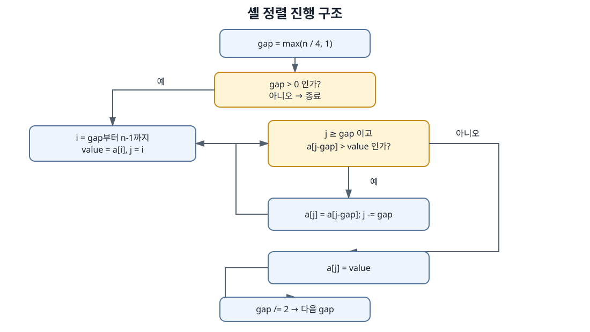

여기서 핵심은 `gap`을 통해 인접하지 않은 원소도 비교할 수 있다는 점이다. 예를 들어 배열의 원소들이 뒤섞여 있어도, 5칸 간격으로 떨어진 원소들이 먼저 정렬되고, 이후 점점 좁은 간격으로 정렬이 마무리된다.

#### 장단점

- 장점
  - 추가 배열이 필요 없다.
  - 큰 규모의 배열에서 삽입 정렬보다 더 나은 성능을 보일 수 있다.
  - 구현이 비교적 단순하다.
- 단점
  - 안정 정렬이 아니다.
  - gap 수열에 따라 성능 편차가 크고, 최악의 경우 시간 복잡도가 높아질 수 있다.

#### 복잡도

- 추가 공간: `O(1)`
- 최선: `O(n log n)` (특정 gap 수열과 입력에 따라)
- 평균: 대체로 `O(n^1.5)` 수준으로 근사
- 최악: `O(n^2)`

이 구현에서는 시작 gap을 `n/4`로 고정했다는 점이 중요하다. 큰 값이 빠르게 정리되면서 전체 정렬 비용을 낮추는 방식으로 동작한다.

---

### 3.2 카운팅 정렬

카운팅 정렬은 값의 범위가 제한된 정수 배열에서 매우 강력한 알고리즘이다. 핵심은 각 값이 몇 번 등장하는지 개수를 세고, 그 누적 결과를 이용해 각 원소가 어떤 위치에 놓여야 하는지를 계산하는 데 있다. 이 방식은 비교 기반 정렬이 아니라 “빈도 기반 정렬”에 가깝다.

이 방식은 비교 기반 정렬이 아니라 “빈도 기반 정렬”에 가깝다. 따라서 정렬 대상 값이 작은 범위의 정수일 때, 비교 횟수보다 값의 등장 횟수 누적이 성능을 좌우한다.

#### Python 구현 관점의 설명

파이썬 구현은 `src/counting_sort.py`에 있으며, 입력 값을 기준으로 최소값과 최대값을 구한 뒤 그 범위만큼의 카운트 배열을 만든다. 이후 각 값의 빈도를 세고, 누적합 방식으로 정렬 위치를 계산하여 새로운 리스트에 다시 배치한다. 여기서 중요한 점은 Python에서는 별도의 리스트 생성과 순회가 비교적 직관적으로 표현되지만, 내부적으로는 C 구현과 같은 빈도 누적과 재배치 과정이 동일하게 동작한다는 것이다.

```python
def counting_sort(values):
    result = list(values)
    if not result:
        return []

    minimum = min(result)
    maximum = max(result)
    counts = [0] * (maximum - minimum + 1)

    for value in result:
        counts[value - minimum] += 1

    sorted_values = []
    for offset, amount in enumerate(counts):
        sorted_values.extend([offset + minimum] * amount)
    return sorted_values
```

이 코드에서 `counts` 배열은 값의 빈도를 저장하는 역할을 하며, 각 값이 실제로 어디에 놓여야 하는지를 번호로 표시하는 누적 구조로 활용된다. 값의 범위가 작을수록 리스트의 크기가 작아서 정렬이 매우 빠르게 수행된다.

#### 코드 관점의 설명

```c
int max = findMax(arr, n);
int *count = calloc(max + 1, sizeof(int));

for (i = 0; i < n; i++) {
    count[arr[i]]++;
}

for (i = 1; i <= max; i++) {
    count[i] += count[i - 1];
}

for (i = n - 1; i >= 0; i--) {
    output[--count[arr[i]]] = arr[i];
}
```

카운팅 정렬의 빈도 계산과 누적합, 출력 배치 흐름은 다음과 같다.

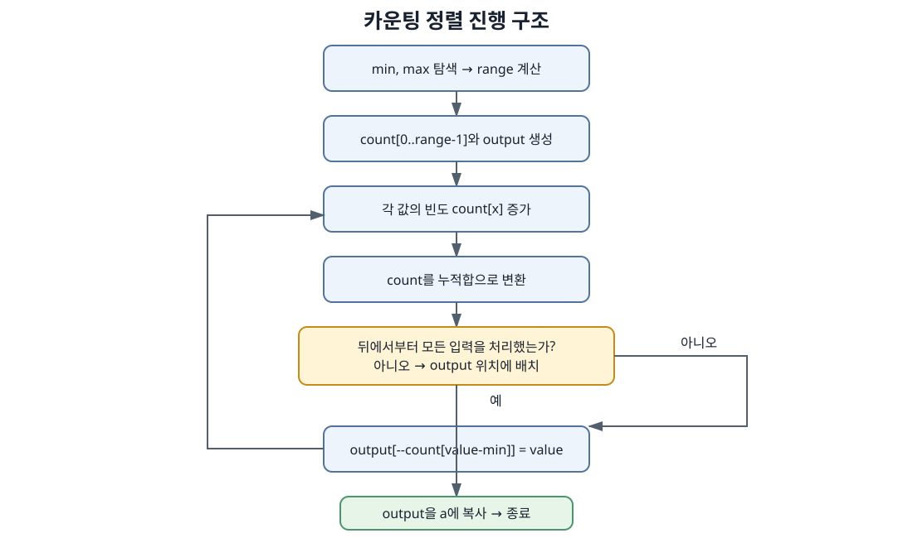

이 과정에서 `count[x]`는 값 `x`보다 작거나 같은 원소가 총 몇 개인지를 의미한다. 이 누적 정보를 이용해 각 값이 어디에 배치되어야 하는지를 결정한다.

#### 안정성

카운팅 정렬은 보통 안정 정렬로 분류된다. 같은 키를 가진 원소들의 상대적 순서를 보존할 수 있기 때문이다. 이는 정렬이 단순한 값 비교에 그치지 않고, 원소의 빈도와 위치 배치까지 함께 다루기 때문에 가능한 특성이다.

#### 장단점

- 장점
  - 값의 범위가 작을 때 매우 빠르다.
  - `O(n+k)` 형태로 동작할 수 있어 대규모 데이터에 유리하다.
  - 안정 정렬이 가능하다.
- 단점
  - 정수 값 범위가 클 경우 메모리 사용량이 크게 늘어난다.
  - 일반적인 비교 기반 정렬처럼 실수나 문자열을 직접 정렬하기 어렵다.

#### 복잡도

- 추가 공간: `O(n+k)`
- 시간: `O(n+k)`
- 여기서 `k`는 입력값의 최대 범위를 의미한다.

값 범위가 제한된 경우에는 매우 우수한 성능을 보이지만, 값이 큰 범위에 걸쳐 분포되어 있으면 카운팅 정렬의 장점이 사라진다.

---

### 3.3 칵테일 셰이커 정렬

칵테일 셰이커 정렬은 버블 정렬의 변형이다. 한쪽 방향으로 큰 값을 뒤로 보내는 대신, 왼쪽에서 오른쪽으로 진행한 뒤 다시 오른쪽에서 왼쪽으로 진행하면서 작은 값을 앞으로 이동시키는 방식이다. 이 알고리즘은 특히 배열의 양 끝이 이미 정렬된 상태에 가깝다면 비교 횟수를 일부 줄일 수 있다.

이 알고리즘은 특히 배열이 양 끝에서 이미 정렬된 상태에 가까울 때 유리할 수 있다. 그러나 전체적으로는 비교 횟수와 교환 횟수가 많아지기 쉬워, 무작위 입력에서는 큰 이점을 얻기 어렵다.

#### Python 구현 관점의 설명

파이썬 구현은 `src/cocktail_shaker_sort.py`에 있으며, `left`와 `right` 인덱스가 각각 배열의 시작과 끝을 가리키면서 양방향으로 정렬을 진행한다. 먼저 왼쪽에서 오른쪽으로 큰 값을 뒤로 보내고, 그다음 오른쪽에서 왼쪽으로 작은 값을 앞으로 보낸다. 한 번의 패스가 끝난 뒤 `swapped` 값이 `False`이면 정렬이 완료된 것으로 간주하고 조기 종료한다.

```python
def cocktail_shaker_sort(values):
    result = list(values)
    left = 0
    right = len(result) - 1

    while left < right:
        swapped = False

        for index in range(left, right):
            if result[index] > result[index + 1]:
                result[index], result[index + 1] = result[index + 1], result[index]
                swapped = True

        right -= 1
        for index in range(right, left, -1):
            if result[index - 1] > result[index]:
                result[index - 1], result[index] = result[index], result[index - 1]
                swapped = True

        left += 1
        if not swapped:
            break

    return result
```

이 구현은 버블 정렬과 매우 비슷하지만, 한 방향에서 끝까지 비교하는 대신 양쪽에서 번갈아 비교하며 정렬을 진행한다. 그래서 전체적으로는 버블 정렬보다 약간 더 나은 성능을 기대할 수 있으나, 구조적으로 여전히 `O(n²)`에 근접한 동작을 하고 있다는 점은 변하지 않는다.

#### 코드 관점의 설명

```c
for (left = 0, right = n - 1; left < right; ) {
    swapped = 0;

    for (i = left; i < right; i++) {
        if (arr[i] > arr[i + 1]) {
            swap(arr[i], arr[i + 1]);
            swapped = 1;
        }
    }
    right--;

    for (i = right; i > left; i--) {
        if (arr[i - 1] > arr[i]) {
            swap(arr[i - 1], arr[i]);
            swapped = 1;
        }
    }
    left++;

    if (!swapped) break;
}
```

칵테일 셰이커 정렬의 양방향 순회와 조기 종료 흐름은 다음과 같다.

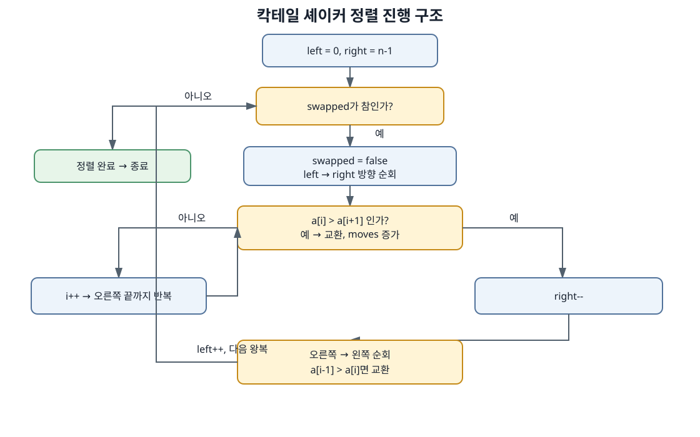

이 구조는 “한 바퀴를 왼쪽에서 오른쪽으로, 한 바퀴를 오른쪽에서 왼쪽으로” 진행한다는 점이 중요하다. 이것은 버블 정렬의 단일 방향 순회를 개선한 형태라고 볼 수 있다.

#### 장단점

- 장점
  - 구현이 단순하다.
  - 배열의 양쪽이 정렬 상태에 가까울 때 효율적일 수 있다.
  - 무작위 배열보다는 특정 분포에서 약간의 이점을 낼 수 있다.
- 단점
  - 여전히 `O(n²)` 수준의 비교를 수행한다.
  - 배열이 거의 정렬되어 있는 경우에도 비교를 피하지 못하는 구조다.

#### 복잡도

- 추가 공간: `O(1)`
- 최선: `O(n)` (교환이 거의 발생하지 않을 때)
- 평균/최악: `O(n²)`

칵테일 셰이커 정렬은 버블 정렬보다 약간 더 나은 경우가 있지만, 전체적으로는 큰 데이터에 대해서는 비효율적이다.

---

## 4. 코드에 대한 부가 설명

### 4.1 통계 누적의 중요성

정렬 알고리즘을 비교할 때 가장 중요한 것은 “어떤 기준으로 측정하느냐”이다. 본 프로젝트에서는 비교 횟수, 이동 횟수, 시간 측정을 모두 분리해 기록하고, 이를 Python과 C 구현에 동일하게 적용한다.

- 비교 횟수: 두 원소를 서로 비교한 횟수
- 이동 횟수: 원소가 한 칸 이동하거나 교환되는 횟수
- 실행 시간: 정렬 알고리즘 자체의 수행 시간

이 값들은 서로 다르게 변화한다. 예를 들어 버블 정렬은 비교 횟수는 비슷해도, 교환이 많아지면 이동 횟수가 급격히 증가한다. 반대로 카운팅 정렬은 비교보다 누적 구조와 배치가 핵심이 되어, 입력 범위가 작을 때는 매우 빠르게 동작한다.

따라서 결과 분석에서는 “시간이 빠르다”만 보고 끝내지 않고, 무엇 때문에 빠른지까지 함께 설명해야 한다.

### 4.2 구현에서 가장 중요한 구조적 요소

#### 1) 반복문 구조

각 알고리즘은 모두 반복 구조를 통해 동작한다. 셸 정렬은 gap을 줄이는 반복문, 카운팅 정렬은 누적 배열 계산, 칵테일 셰이커 정렬은 좌우 양방향 순회를 수행한다. Python 구현은 C 구현의 구조를 거의 그대로 유지하면서, 문법만 리스트와 루프 중심으로 바꾼 형태이다.

#### 2) 배열 수정 방식

- 셸 정렬: 제자리 정렬, 추가 메모리 거의 없음
- 카운팅 정렬: 출력 배열을 별도로 사용
- 칵테일 셰이커: 제자리 교환 중심

즉, 구현 방식은 단순히 “정렬 결과를 맞춘다”를 넘어, 메모리 사용량과 성능 분포에도 직접적인 영향을 미친다.

#### 3) 안정성 판단 기준

동일한 키 값이 여러 개 있을 때 입력 순서가 보존되는지를 안정성으로 본다. 카운팅 정렬은 일반적으로 안정적이고, 셸 정렬은 불안정하다. 칵테일 셰이커 정렬도 일반적으로 안정 정렬이라고 보기는 어렵지만, 일부 조건에서는 상대적 순서가 유지될 수 있다.

---

## 5. 실험 방법과 시각화

### 5.1 실험 체계

본 실험은 다음 순서로 진행된다.

1. 입력 배열 생성
2. 동일한 입력을 각 알고리즘에 복사
3. 알고리즘 실행
4. 비교 횟수·이동 횟수·시간 측정
5. 정렬 결과 검증
6. CSV 저장 및 그래프 생성

이 과정은 모든 알고리즘에 동일하게 적용되므로, 결과를 공정하게 비교할 수 있다.

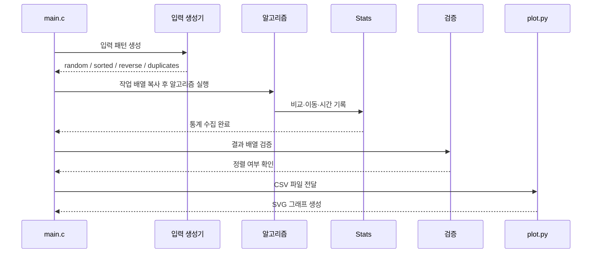

Python 실험도 이 구조를 그대로 따라간다. `src/main.py`는 입력을 만들고, 각 정렬 함수가 입력을 받아 정렬 후 결과를 검증하며, 출력 형식이 같도록 CSV나 터미널 문자열 포맷을 생성한다. 즉, C와 Python 사이에 비교 기준을 맞추는 설계가 동일하게 유지된다.

### 5.2 실험 결과

입력 형태와 입력 크기에 따라 나타나는 알고리즘의 차이를 그래프를 활용하여 시각적으로 표현하였다.

#### 5.2.1 입력 형태에 따른 알고리즘의 상대적 작업량 차이

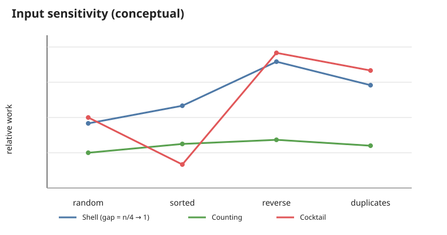

그래프를 통해 각 입력 패턴에서 알고리즘이 보일 수 있는 상대적인 작업량 차이를 나타내었고, 실제 실행 시간과 비교 횟수, 이동 횟수는 입력 크기와 값의 분포, 구현 방식에 따라 달라질 수 있기 때문에, 이후 그래프에서 나타나는 구체적인 수치 데이터도 함께 다뤄줘야 한다.

#### 5.2.2 이론적 복잡도

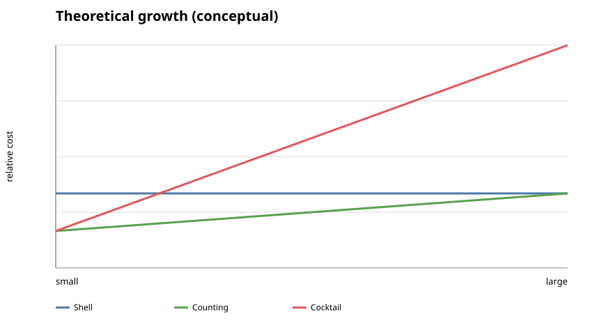

복잡도 그래프는 각 알고리즘이 입력 크기 증가에 따라 얼마나 빠르게 비용이 증가하는지를 보여 준다.

#### 5.2.3 입력 형태에 따른 실행 시간

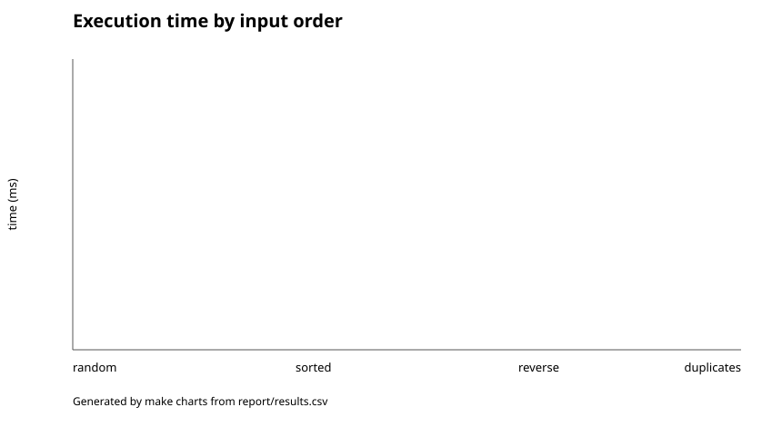

#### 5.2.4 입력 형태에 따른 비교 횟수


#### 5.2.5 입력 형태에 따른 이동 횟수

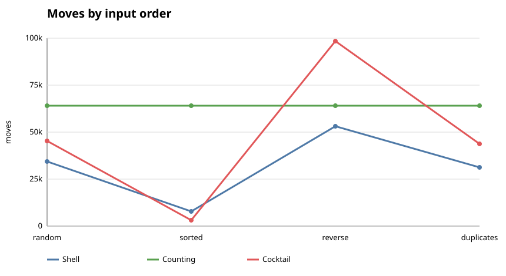

#### 5.2.6 입력 크기 증가에 따른 시간 변화

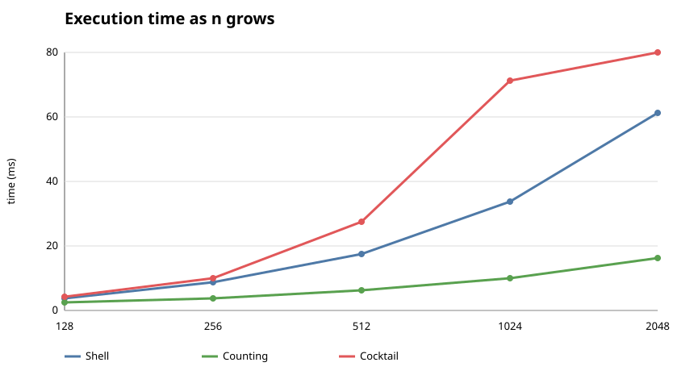

그래프를 통해 입력 크기가 커질수록 알고리즘이 얼마나 급격히 느려지는지를 확인할 수 있다. 이때, 가장 중요한 것은 복잡도가 비슷해 보일 때도 실제 실행 시간에서 차이가 날 수 있다는 점이다. 특히 Python 구현은 C 구현과 비교했을 때 단순한 루프 구조나 객체 생성 비용이 더 크게 반영될 수 있다.

---

## 6. 결과 해석

### 6.1 알고리즘별 요약

| 알고리즘 | 최선 | 평균 | 최악 | 추가 공간 | 안정성 |
| --- | --- | --- | --- | --- | --- |
| 셸 정렬 | `O(n log n)` | `O(n^1.5)` 근사 | `O(n²)` | `O(1)` | 아니오 |
| 카운팅 정렬 | `O(n+k)` | `O(n+k)` | `O(n+k)` | `O(n+k)` | 예 |
| 칵테일 셰이커 | `O(n)` | `O(n²)` | `O(n²)` | `O(1)` | 대체로 예 |

### 6.2 실험 결과 해석

- 셸 정렬은 큰 gap으로 빠르게 정리하고 점점 미세하게 보정하는 방식이라 무작위 입력에서 비교적 안정적인 성능을 보인다.
- 카운팅 정렬은 값 범위가 작을 때 매우 강력하지만, 값 범위가 커지면 메모리 사용량과 비용이 급증한다.
- 칵테일 셰이커 정렬은 구현이 간단하고, 특정 입력 형태에서는 어느 정도 효율적이지만, 전체적으로는 `O(n²)` 구조를 벗어나기 어렵다.

따라서 정렬 알고리즘을 선택할 때는 한 번에 가장 빠른 알고리즘을 고르기보다, 입력 데이터의 범위와 분포에 따라 상황에 맞는 최적의 알고리즘을 선택해야 한다. 특히 Python 버전은 C 버전보다 실행 환경이 달라질 수 있으므로, 구현 언어의 차이를 반영해 해석하는 것이 중요하다.

---

## 7. 결론

이번 보고서에서는 세 가지 정렬 알고리즘의 원리, 구현, 실험 절차, 시각화 결과를 함께 정리하였다. 핵심 결론은 단순히 속도 하나만 비교하는 것이 아니라, 데이터의 성질과 구조적 특성을 함께 고려해야 한다는 점이다.

- 셸 정렬은 간단하지만 유연한 구조로, 비교적 대규모의 무작위 배열에 적합하다.
- 카운팅 정렬은 제한된 범위의 정수 입력에서는 탁월한 성능을 낸다.
- 칵테일 셰이커 정렬은 구현이 단순하고 직관적이지만, 전체적으로는 대규모 입력에서 불리하다.

정렬 알고리즘은 어떤 문제를 풀고 있는지, 입력 데이터의 특성이 무엇인지에 따라 최적의 선택이 달라진다. 따라서 이 보고서는 단순한 비교 결과를 넘어서, 각 알고리즘이 왜 그렇게 동작하는지, 어떤 데이터에서 강점을 가지는지를 함께 설명하는 통합적인 정리로 의미를 가진다.

---

## 8. 참고 자료

1. [Wikipedia — Sorting algorithm](https://en.wikipedia.org/wiki/Sorting_algorithm)
2. [Wikipedia — Shellsort](https://en.wikipedia.org/wiki/Shellsort)
3. [Wikipedia — Counting sort](https://en.wikipedia.org/wiki/Counting_sort)
4. [Wikipedia — Cocktail shaker sort](https://en.wikipedia.org/wiki/Cocktail_shaker_sort)
5. [강의 실습 template](https://github.com/lec-algorithm/hw1-sample-2026)
