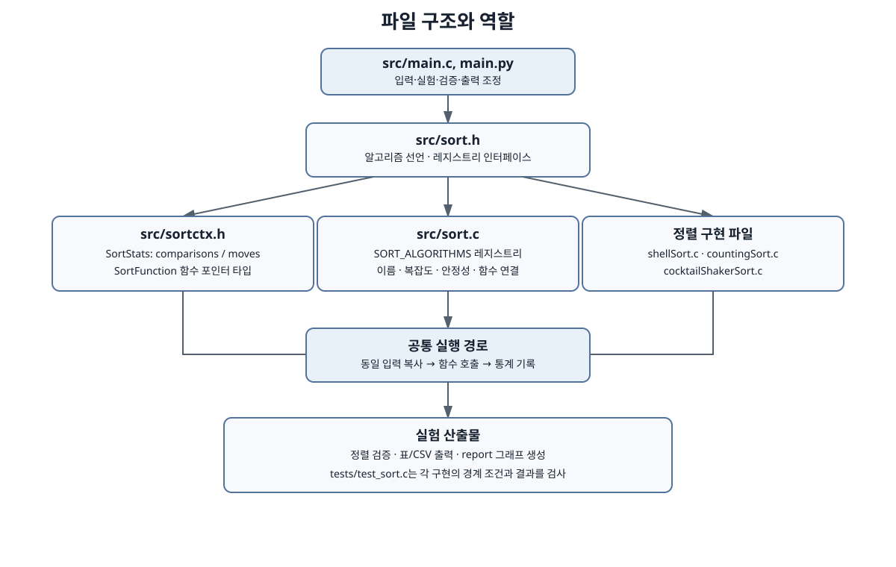
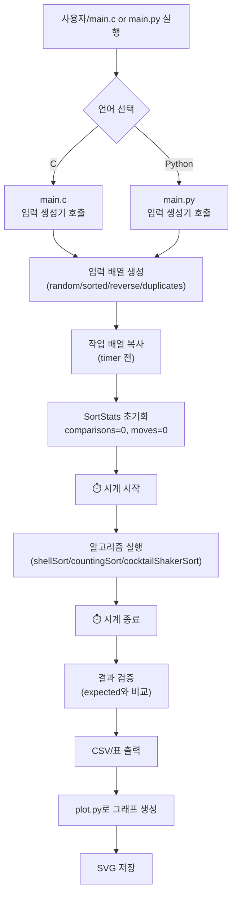
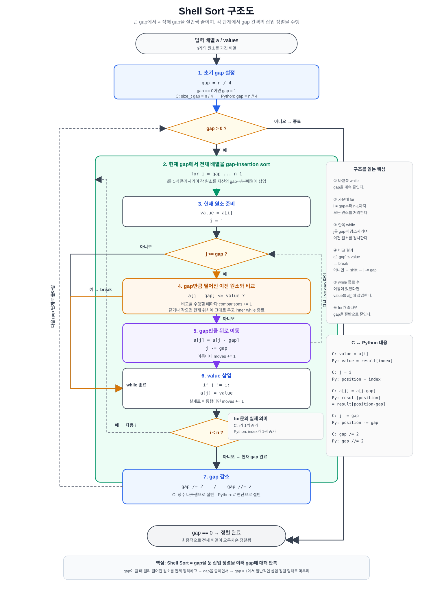
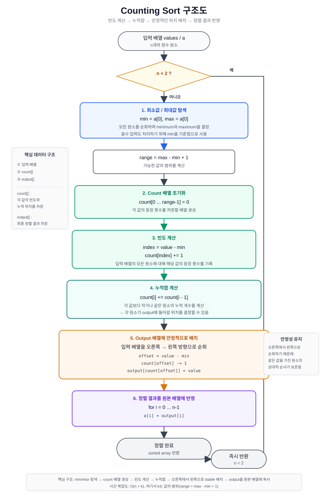
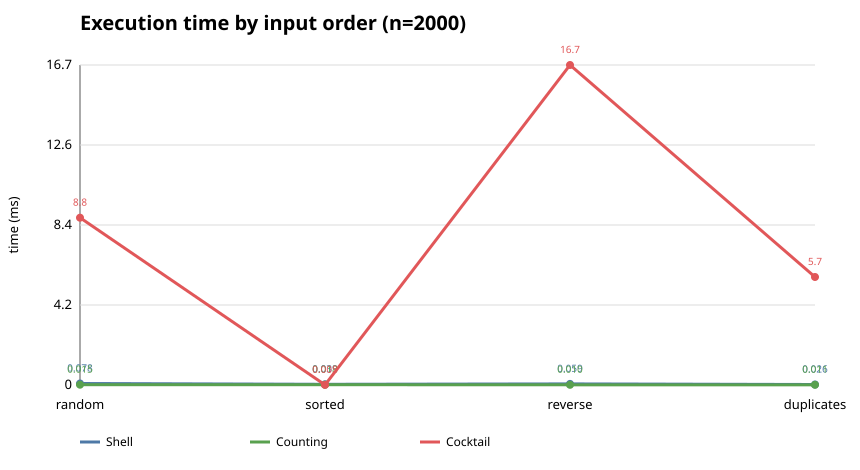
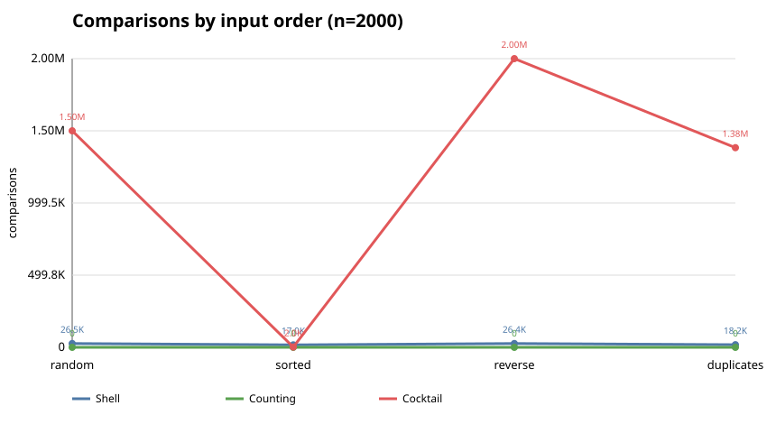
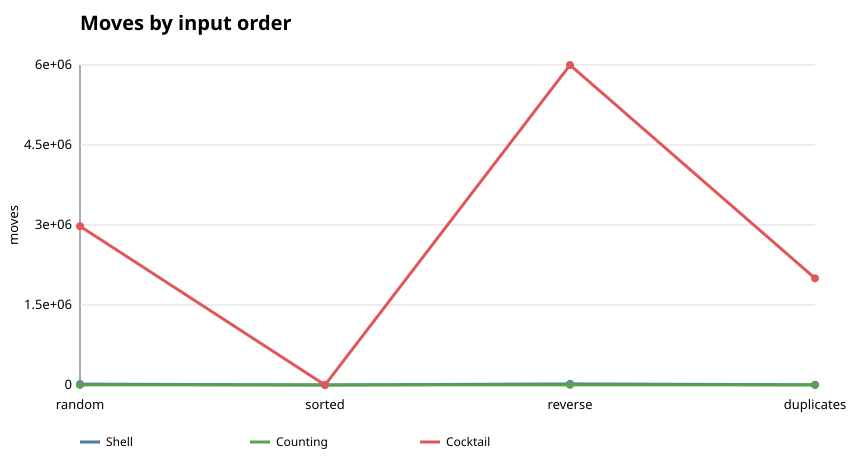
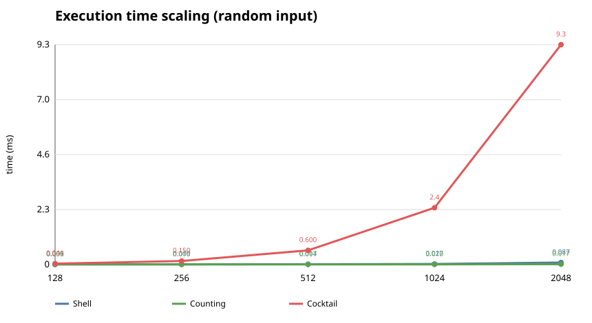

# 정렬 비교 보고서 (셸 · 카운팅 · 칵테일 셰이커)

## 1. 과제 개요

이번 과제를 통해 셸 정렬, 카운팅 정렬, 칵테일 셰이커 정렬, 총 세 개의 정렬 알고리즘을 C언어와 파이썬, 총 2개의 언어를 바탕으로 공통된 인터페이스에서 비교합니다.

### 1.1 비교 목표

정렬 알고리즘은 입력 조건과 측정 방식에 따라 결과가 달라질 수 있습니다. 본 과제에서는:

- 비교 대상: 셸 정렬, 카운팅 정렬, 칵테일 셰이커 정렬
- 공통 조건: 오름차순 정렬, 동일한 입력 생성기, 동일한 측정 루틴, 동일한 출력 포맷
- 핵심 질문:
  - 어떤 입력에서 빠른가?
  - 어떤 입력에서 비교·교환이 많아지는가?
  - 안정성, 추가 메모리, 구현 난이도는 어떤 차이가 있는가?

이번 과제를 통해 C언어와 파이썬을 활용하여 코드를 작성하고, 정렬 함수의 작동이 제대로 되는지를 확인하는 것보다, 전체적으로 알고리즘의 진정한 특성이 입력과 환경에 따라 어떻게 나타나는지를 이해하는 것을 목표로 합니다.

---

## 2. 구현 구조와 실험 인터페이스

### 2.1 전체 설계 의도

입력 생성 방식, 시간 측정 방식, 통계 집계 방식이 조금만 달라도 결과가 서로 다르게 보이기 때문에 세 알고리즘을 각각 따로 구현하는 것만으로는 공정한 비교가 불가능합니다. 본 과제에서는 다음을 보장합니다:

**정렬 함수 내부에서는 비교 횟수와 이동 횟수를 `SortStats`에 누적합니다. 실행 시간은 정렬 함수 호출 구간에서 `main.c`와 `main.py`에서 별도로 측정합니다.**

```c
/* C: sortctx.h에서 정의 */
typedef struct {
    unsigned long long comparisons;
    unsigned long long moves;
} SortStats;
```

```python
# Python: sort_stats.py에서 정의
@dataclass
class SortStats:
    """Counters shared by all Python sorting implementations."""
    comparisons: int = 0
    moves: int = 0
```

이 구조는 다음을 보장합니다:

1. 같은 입력 조건으로 모든 알고리즘을 시험한다.
2. 비교 횟수와 이동 횟수를 동일한 기준으로 기록한다.
3. 시간 측정이 구현마다 달라지지 않는다.
4. 알고리즘을 추가해도 측정 코드와 테스트 코드를 크게 바꾸지 않아도 된다.

### 2.2 핵심 파일 설명

#### C 구조체 정의

**`src/sortctx.h`** — 모든 C 정렬 구현이 공유하는 기본 구조체와 함수 포인터를 정의합니다:

```c
#ifndef SORTCTX_H
#define SORTCTX_H

#include <stddef.h>

/* Counters shared by every C sorting implementation. */
typedef struct {
    unsigned long long comparisons;
    unsigned long long moves;
} SortStats;

typedef void (*SortFunction)(int *, size_t, SortStats *);

#endif
```

모든 C 정렬 함수는 `void func(int *array, size_t n, SortStats *stats)` 형태의 서명을 따릅니다. 이를 통해 `main.c`에서 동일한 인터페이스로 모든 알고리즘을 호출할 수 있습니다.

**`src/sort.h`** — C 정렬 함수의 선언과 알고리즘 레지스트리 구조를 정의합니다:

```c
#ifndef SORT_H
#define SORT_H

#include <stddef.h>
#include "sortctx.h"

typedef struct {
    const char *name;
    const char *timeComplexity;
    const char *spaceComplexity;
    int stable;
    SortFunction sort;
} SortAlgorithm;

void shellSort(int a[], size_t n, SortStats *stats);
void countingSort(int a[], size_t n, SortStats *stats);
void cocktailShakerSort(int a[], size_t n, SortStats *stats);

extern const SortAlgorithm SORT_ALGORITHMS[];
extern const size_t SORT_ALGORITHM_COUNT;

#endif
```

**`src/sort.c`** — 알고리즘 레지스트리를 구현하여 모든 정렬 함수와 메타데이터를 한곳에 모아 관리합니다.

#### Python 구조체 정의

**`src/sort_stats.py`** — Python 정렬 구현이 공유하는 통계 클래스:

```python
"""Shared statistics for Python sorting implementations."""

from dataclasses import dataclass


@dataclass
class SortStats:
    """Counters shared by all Python sorting implementations."""

    comparisons: int = 0
    moves: int = 0
```

Python의 모든 정렬 함수는 `result = algorithm(array, stats=stats, copy_input=False)` 형태로 호출되며, `stats` 객체를 통해 통계를 누적합니다.

### 2.3 파일 구성

| 파일 | 역할 |
| --- | --- |
| `src/sortctx.h` | C 정렬의 기본 구조체(`SortStats`, `SortFunction`) 정의 |
| `src/sort.h` | C 정렬 함수 선언 및 알고리즘 레지스트리 구조 정의 |
| `src/sort.c` | 알고리즘 레지스트리 구현 |
| `src/shellSort.c` | 셸 정렬 C 구현 |
| `src/countingSort.c` | 카운팅 정렬 C 구현 |
| `src/cocktailShakerSort.c` | 칵테일 셰이커 정렬 C 구현 |
| `src/main.c` | 입력 생성, 복사, 시간 측정, 검증, CSV 및 표 출력 |
| `src/sort_stats.py` | Python `SortStats` 클래스 정의 |
| `src/sort.py` | Python 알고리즘 레지스트리 및 공개 API |
| `src/shell_sort.py` | 셸 정렬 Python 구현 |
| `src/counting_sort.py` | 카운팅 정렬 Python 구현 |
| `src/cocktail_shaker_sort.py` | 칵테일 셰이커 정렬 Python 구현 |
| `src/main.py` | 입력 생성, 시간 측정, 검증, CSV/표준 출력 실행 |
| `tests/test_sort.c` | C 구현 경계 조건 및 결과 검증 |
| `tests/test_sort.py` | Python 구현 경계 조건 및 결과 검증 |
| `tools/plot.py` | CSV를 읽어 SVG 그래프 생성 |

### 2.4 실행 흐름 구조도



```mermaid
flowchart TD
    A[사용자/main.c or main.py 실행] --> B{언어 선택}
    B -->|C| C["main.c<br/>입력 생성기 호출"]
    B -->|Python| D["main.py<br/>입력 생성기 호출"]
    
    C --> E["입력 배열 생성<br/>(random/sorted/reverse/duplicates)"]
    D --> E
    
    E --> F["작업 배열 복사<br/>(timer 전)"]
    F --> G["SortStats 초기화<br/>comparisons=0, moves=0"]
    G --> H["⏱️ 시계 시작"]
    
    H --> I["알고리즘 실행<br/>(shellSort/countingSort/cocktailShakerSort)"]
    I --> J["⏱️ 시계 종료"]
    
    J --> K["결과 검증<br/>(expected와 비교)"]
    K --> L["CSV/표 출력"]
    L --> M["plot.py로 그래프 생성"]
    M --> N["SVG 저장"]
```

### 2.5 C 메인 함수 흐름

C에서는 다음과 같이 동작합니다:

```c
/* main.c의 핵심 실행 흐름 */
int main(int argc, char **argv) {
    int csv = 0;
    int blocks = 0;
    
    /* 인자 파싱 */
    for (int i = 1; i < argc; ++i) {
        if (strcmp(argv[i], "--csv") == 0) csv = 1;
        else if (strcmp(argv[i], "--blocks") == 0) blocks = 1;
    }

    /* 헤더 출력 */
    if (csv || blocks) {
        printf("algorithm,input,n,comparisons,moves,time_ms,valid\n");
    } else {
        printf("=== sorting comparison ===\n");
        printf("%-20s %-12s %8s %12s %12s %10s %s\n",
            "algorithm", "input", "n", "comparisons", "moves", "time(ms)", "valid");
    }

    /* 일반 입력 실행 (random/sorted/reverse/duplicates) */
    if (!blocks) {
        for (size_t kind = 0; kind < sizeof SPECS / sizeof SPECS[0]; ++kind) {
            if (!run_case(&SPECS[kind], kind, csv)) {
                return 1;
            }
        }
    }

    /* 크기 증가 실험 (block) */
    if (blocks) {
        static const size_t block_sizes[] = {128, 256, 512, 1024, 2048};
        for (size_t b = 0; b < sizeof block_sizes / sizeof block_sizes[0]; ++b) {
            InputSpec block = {"block", block_sizes[b]};
            if (!run_case(&block, 0, 1)) {
                return 1;
            }
        }
    }

    return 0;
}

/* 각 케이스 실행 */
static int run_case(const InputSpec *spec, size_t kind, int csv) {
    int *input = malloc(spec->size * sizeof *input);
    int *work = malloc(spec->size * sizeof *work);
    int *expected = malloc(spec->size * sizeof *expected);

    make_input(input, spec->size, kind);          /* 입력 생성 */
    memcpy(expected, input, spec->size * sizeof *expected);
    qsort(expected, spec->size, sizeof *expected, compare_ints);  /* 예상 결과 */

    for (size_t algorithm = 0; algorithm < SORT_ALGORITHM_COUNT; ++algorithm) {
        memcpy(work, input, spec->size * sizeof *work);  /* 복사 */
        SortStats stats = {0, 0};

        clock_t start = clock();                    /* 타이머 시작 */
        SORT_ALGORITHMS[algorithm].sort(work, spec->size, &stats);
        clock_t end = clock();                      /* 타이머 종료 */

        double ms = 1000.0 * (double)(end - start) / (double)CLOCKS_PER_SEC;
        int valid = same_array(work, expected, spec->size);

        print_result(SORT_ALGORITHMS[algorithm].name, spec->name,
                     spec->size, &stats, ms, csv, valid);
    }

    free(input);
    free(work);
    free(expected);
    return 1;
}
```

### 2.6 Python 메인 함수 흐름

Python에서는 다음과 같이 동작합니다:

```python
def run_case(name, values, csv):
    expected = sorted(values)

    for algorithm_name, algorithm in SORT_ALGORITHMS:
        # 입력 복사는 타이밍 전에 수행 (C와 동일)
        work = list(values)
        stats = SortStats()

        # 정렬 구간 타이밍
        start = time.perf_counter()
        result = algorithm(
            work,
            stats=stats,
            copy_input=False,
        )
        elapsed = (time.perf_counter() - start) * 1000

        valid = result == expected

        if csv:
            print(
                f"{algorithm_name},{name},{len(values)},"
                f"{stats.comparisons},{stats.moves},"
                f"{elapsed:.3f},{str(valid).lower()}"
            )
        else:
            print(
                f"{algorithm_name:20} "
                f"{name:12} "
                f"{len(values):8} "
                f"{stats.comparisons:12} "
                f"{stats.moves:12} "
                f"{elapsed:10.3f} "
                f"{'yes' if valid else 'NO'}"
            )


def main():
    parser = argparse.ArgumentParser()
    parser.add_argument("--csv", action="store_true")
    parser.add_argument("--blocks", action="store_true")
    args = parser.parse_args()

    csv = args.csv or args.blocks

    if csv:
        print("algorithm,input,n,comparisons,moves,time_ms,valid")
    else:
        print("=== sorting comparison ===")
        print(
            f"{'algorithm':20} "
            f"{'input':12} "
            f"{'n':8} "
            f"{'comparisons':12} "
            f"{'moves':12} "
            f"{'time(ms)':10} "
            f"valid"
        )

    if args.blocks:
        for size in (128, 256, 512, 1024, 2048):
            run_case("block", make_input(size, "random"), True)
    else:
        for name in ("random", "sorted", "reverse", "duplicates"):
            run_case(name, make_input(2000, name), csv)
```

### 2.7 입력 생성 방식

실험에서는 네 가지 입력 패턴을 사용합니다:

- `random`: 무작위 배열 — `(i * 73 + 19) % 1000 - 500`
- `sorted`: 이미 정렬된 배열 — `[0, 1, 2, ..., n-1]`
- `reverse`: 역순 배열 — `[n-1, n-2, ..., 1, 0]`
- `duplicates`: 중복 값이 많은 배열 — `(i * 7 + 3) % 21 - 10`

이 네 종류는 단일 정렬 알고리즘의 좋은 경우와 나쁜 경우가 각각 무엇인지 확인하는 데 매우 중요합니다.

---

## 3. 알고리즘별 원리와 코드 설명

### 3.1 셸 정렬

셸 정렬은 삽입 정렬을 단일 배열 전체에 적용하는 대신, 일정한 간격(gap)을 두고 부분 배열을 정렬하면서 점점 간격을 줄여가는 방식입니다.

핵심 아이디어는 **"큰 값이 멀리 떨어진 곳에 있으면 큰 간격으로 먼저 정리하고, 점점 세밀하게 다듬는다"**는 점입니다. 이 방식은 단순 삽입 정렬만 사용하는 것보다 훨씬 빠릅니다.

#### C언어 구현

```c
/*
 * Shell sort with a quarter-size initial gap.
 * The gap sequence is floor(n / 4), floor(n / 8), ... , 1.
 */
void shellSort(int a[], size_t n, SortStats *s) {
    size_t gap = n / 4;
    if (gap == 0) gap = 1;

    while (gap > 0) {
        for (size_t i = gap; i < n; ++i) {
            int value = a[i];
            size_t j = i;
            while (j >= gap) {
                s->comparisons++;                    /* 비교 카운트 */
                if (a[j - gap] <= value) break;
                a[j] = a[j - gap];
                s->moves++;                          /* 이동 카운트 */
                j -= gap;
            }
            if (j != i) {
                a[j] = value;
                s->moves++;                          /* 최종 대입 카운트 */
            }
        }
        gap /= 2;
    }
}
```

**진행 방식:**

1. `gap = n / 4`에서 시작합니다.
2. gap만큼 떨어진 원소들을 비교하고 삽입 정렬합니다.
3. gap을 절반으로 줄입니다.
4. gap이 0이 될 때까지 반복합니다.

**예시 (n=16, gap 수열: 4 → 2 → 1):**

```
원래 배열:  [16, 12, 8, 4, 15, 11, 7, 3, 14, 10, 6, 2, 13, 9, 5, 1]

gap=4 후:   [4, 3, 1, 2, 5, 9, 6, 1, ...]   (4칸씩 떨어진 원소 정렬)

gap=2 후:   [1, 2, 3, 4, 5, 6, ...]         (2칸씩 떨어진 원소 정렬)

gap=1 후:   [1, 2, 3, 4, 5, 6, ..., 16]     (1칸씩 = 최종 삽입 정렬)
```

#### Python 구현

파이썬 버전은 C와 동일한 gap 수열을 사용합니다:

```python
def shell_sort(values, stats=None, copy_input=True):
    result = list(values) if copy_input else values
    if stats is None:
        stats = SortStats()
    
    gap = max(1, len(result) // 4)

    while gap > 0:
        for index in range(gap, len(result)):
            value = result[index]
            j = index
            while j >= gap:
                stats.comparisons += 1
                if result[j - gap] <= value:
                    break
                result[j] = result[j - gap]
                stats.moves += 1
                j -= gap
            if j != index:
                result[j] = value
                stats.moves += 1
        gap //= 2

    return result
```

#### 장단점

- **장점**
  - 추가 배열이 필요 없습니다.
  - 큰 규모의 배열에서 삽입 정렬보다 훨씬 더 나은 성능을 보입니다.
  - 구현이 비교적 단순합니다.

- **단점**
  - 안정 정렬이 아닙니다.
  - gap 수열에 따라 성능 편차가 크게 변합니다.

#### 복잡도

- 추가 공간: `O(1)`
- 최선: `O(n log n)` (특정 gap 수열과 입력에 따라)
- 평균: gap 수열에 의존 (본 구현은 대략 `O(n^1.5)` 근처)
- 최악: `O(n²)`

**중요:** Shell sort의 시간 복잡도는 gap sequence에 크게 의존합니다. 본 구현에서 사용하는 `gap = n/4, n/8, ..., 1` 수열은 평균적으로 `O(n^1.5)` 근처의 성능을 보이지만, 모든 Shell sort의 일반적인 복잡도를 단정하지 않는 것이 정확합니다.

---

### 3.2 카운팅 정렬

카운팅 정렬은 값의 범위가 제한된 정수 배열에서 매우 강력한 알고리즘입니다. 핵심은 **각 값이 몇 번 등장하는지 개수를 세고, 그 누적 결과를 이용해 각 값이 정렬된 배열에서 어느 위치에 들어가야 하는지 계산**하는 것입니다.

이 방식은 비교 기반 정렬이 아니라 "빈도 기반 정렬"에 가깝습니다.

#### C언어 구현

```c
/* 음수도 처리하기 위해 min을 0번 인덱스로 옮긴다. */
void countingSort(int a[], size_t n, SortStats *s) {
    if (n < 2) return;
    
    int min = a[0], max = a[0];
    for (size_t i = 1; i < n; ++i) { 
        if (a[i] < min) min = a[i]; 
        if (a[i] > max) max = a[i]; 
    }
    
    size_t range = (size_t)((long long)max - min + 1);
    size_t *count = calloc(range, sizeof *count);
    int *output = malloc(n * sizeof *output);
    if (!count || !output) { free(count); free(output); return; }
    
    /* 빈도 계산 */
    for (size_t i = 0; i < n; ++i) 
        count[(size_t)((long long)a[i] - min)]++;
    
    /* 누적합 계산 */
    for (size_t i = 1; i < range; ++i) 
        count[i] += count[i - 1];
    
    /* 뒤에서부터 출력 배열에 배치 (안정성 보장) */
    for (size_t i = n; i-- > 0;) 
        output[--count[(size_t)((long long)a[i] - min)]] = a[i];
    
    /* 최종 복사 */
    for (size_t i = 0; i < n; ++i) { 
        a[i] = output[i]; 
        s->moves++;  /* 복사 횟수만 카운트 */
    }
    
    free(count); free(output);
}
```


**진행 방식:**

1. 최솟값과 최댓값을 찾습니다.
2. `k = max - min + 1`로 범위를 계산합니다.
3. count 배열에 각 값의 빈도를 누적합니다.
4. 뒤에서부터 output 배열에 원소를 배치하여 안정성을 보장합니다.
5. 최종 결과를 원래 배열로 복사합니다.

**예시:**

```
입력:           [5, 2, 3, 2, 5]
min=2, max=5, k=4

빈도:           [0, 0, 1, 0]  (값 2: 1개, 값 5: 2개)
                 0  1  2  3   (인덱스는 value - min)

누적합:         [0, 2, 2, 4]  (값 2: 위치 0-1, 값 5: 위치 2-3)

뒤에서부터 배치:
  i=4: a[4]=5 → count[3]=3 → output[3]=5
  i=3: a[3]=2 → count[0]=1 → output[1]=2
  i=2: a[2]=3 → count[1]=1 → output[0]=3
  i=1: a[1]=2 → count[0]=0 → output[0]=2
  i=0: a[0]=5 → count[3]=2 → output[2]=5

출력:           [2, 2, 3, 5, 5]
```

**중요:** 현재 구현에서는 min/max 탐색 과정의 비교를 `comparisons` 카운터에 포함하지 않습니다. 따라서 Counting sort의 `comparisons` 값은 항상 0으로 기록됩니다. 이는 의도된 동작입니다.

#### Python 구현

파이썬 구현은 입력 값을 기준으로 최소값과 최대값을 구한 뒤 그 범위만큼의 카운트 배열을 만듭니다:

```python
def counting_sort(values, stats=None, copy_input=True):
    result = list(values) if copy_input else values
    if stats is None:
        stats = SortStats()
    if not result:
        return []

    minimum = min(result)
    maximum = max(result)
    counts = [0] * (maximum - minimum + 1)

    for value in result:
        counts[value - minimum] += 1

    sorted_values = []
    for offset, amount in enumerate(counts):
        sorted_values.extend([offset + minimum] * amount)
    
    return sorted_values
```

#### 안정성

카운팅 정렬은 보통 안정 정렬로 분류됩니다. 같은 키를 가진 원소들의 상대적 순서를 보존할 수 있기 때문입니다. 본 구현에서는 뒤에서부터 output 배열에 원소를 배치하는 방식을 사용하여 안정성을 보장합니다.

#### 장단점

- **장점**
  - 값의 범위가 작을 때 매우 빠릅니다.
  - `O(n+k)` 형태로 동작할 수 있어 대규모 데이터에 유리합니다.
  - 안정 정렬이 가능합니다.

- **단점**
  - 정수 값 범위가 클 경우 메모리 사용량이 크게 늘어납니다.
  - 실수나 문자열을 직접 정렬하기 어렵습니다.

#### 복잡도

- 추가 공간: `O(n+k)`
- 시간: `O(n+k)`

**여기서 `k = max - min + 1`**, 즉 입력값의 최솟값과 최댓값 사이에 포함되는 정수 값의 개수입니다.

---

### 3.3 칵테일 셰이커 정렬

칵테일 셰이커 정렬은 버블 정렬의 변형입니다. 한쪽 방향으로 큰 값을 뒤로 보내는 대신, **왼쪽에서 오른쪽으로 진행한 뒤 다시 오른쪽에서 왼쪽으로 진행**하면서 작은 값을 앞으로 가져옵니다.

이 알고리즘은 특히 배열이 양 끝에서 이미 정렬된 상태에 가까울 때 유리할 수 있습니다.

#### C언어 구현

```c
/* 양방향으로 한 번씩 훑어 큰 값과 작은 값을 동시에 확정한다. */
void cocktailShakerSort(int a[], size_t n, SortStats *s) {
    if (n < 2) return;
    
    size_t left = 0, right = n - 1;
    int swapped = 1;
    
    while (swapped) {
        swapped = 0;
        
        /* 왼쪽에서 오른쪽으로: 큰 값을 오른쪽으로 이동 */
        for (size_t i = left; i < right; ++i) { 
            s->comparisons++; 
            if (a[i] > a[i + 1]) { 
                int t = a[i]; 
                a[i] = a[i + 1]; 
                a[i + 1] = t; 
                s->moves += 3;          /* swap = 3 대입 */
                swapped = 1; 
            } 
        }
        if (!swapped) break;
        --right;
        
        swapped = 0;
        
        /* 오른쪽에서 왼쪽으로: 작은 값을 왼쪽으로 이동 */
        for (size_t i = right; i > left; --i) { 
            s->comparisons++; 
            if (a[i-1] > a[i]) { 
                int t = a[i-1]; 
                a[i-1] = a[i]; 
                a[i] = t; 
                s->moves += 3;          /* swap = 3 대입 */
                swapped = 1; 
            } 
        }
        ++left;
    }
}
```

**진행 방식:**

1. 왼쪽 포인터(`left`)와 오른쪽 포인터(`right`)를 설정합니다.
2. 왼쪽에서 오른쪽으로 진행하면서 큰 값을 오른쪽으로 이동시킵니다.
3. 오른쪽에서 왼쪽으로 진행하면서 작은 값을 왼쪽으로 이동시킵니다.
4. 한 바퀴에서 교환이 없으면 정렬이 완료됩니다.

**예시:**

```
원래 배열: [3, 1, 4, 1, 5, 9, 2, 6]

Pass 1 (L→R):  비교 쌍: (3,1), (1,4), (4,1), (1,5), (5,9), (9,2), (2,6)
                → [1, 3, 1, 4, 5, 2, 6, 9]  (9가 끝에 확정)

Pass 1 (R→L):  비교 쌍: (6,2), (2,5), (5,4), (4,1), (1,3), (3,1)
                → [1, 1, 3, 4, 5, 2, 6, 9]  (1이 처음에 확정)

... (반복)
```

#### Python 구현

파이썬 구현은 C와 동일한 양방향 순회를 사용합니다:

```python
def cocktail_shaker_sort(values, stats=None, copy_input=True):
    result = list(values) if copy_input else values
    if stats is None:
        stats = SortStats()
    
    if len(result) < 2:
        return result
    
    left = 0
    right = len(result) - 1

    while left < right:
        swapped = False

        /* 왼쪽 → 오른쪽 */
        for index in range(left, right):
            stats.comparisons += 1
            if result[index] > result[index + 1]:
                result[index], result[index + 1] = result[index + 1], result[index]
                stats.moves += 3  /* swap = 3 대입 */
                swapped = True

        right -= 1
        
        /* 오른쪽 → 왼쪽 */
        for index in range(right, left, -1):
            stats.comparisons += 1
            if result[index - 1] > result[index]:
                result[index - 1], result[index] = result[index], result[index - 1]
                stats.moves += 3  /* swap = 3 대입 */
                swapped = True

        left += 1
        if not swapped:
            break

    return result
```

#### 장단점

- **장점**
  - 구현이 단순합니다.
  - 배열의 양쪽이 정렬 상태에 가까울 때 효율적일 수 있습니다.

- **단점**
  - 여전히 `O(n²)` 수준의 비교를 수행합니다.
  - 배열이 거의 정렬되어 있는 경우에도 비교를 완전히 피하지 못합니다.

#### 복잡도

- 추가 공간: `O(1)`
- 최선: `O(n)` (이미 정렬된 경우)
- 평균/최악: `O(n²)`

---

## 4. 코드에 대한 부가 설명

### 4.1 통계 누적의 중요성

정렬 알고리즘을 비교할 때 가장 중요한 것은 **"어떤 기준으로 측정하느냐"**입니다. 비교 횟수, 이동 횟수, 시간 측정을 모두 분리해 기록하고, 이를 합리적으로 해석해야 합니다.

본 구현에서는 다음과 같이 정의합니다:

- **비교 횟수**: 해당 구현에서 `comparisons` 카운터가 증가하는 원소 비교의 횟수
- **이동 횟수**: 해당 구현에서 `moves` 카운터가 증가하는 배열 대입 또는 교환 작업의 횟수
- **실행 시간**: 정렬 함수 호출 구간에서 측정한 수행 시간

알고리즘마다 내부 자료구조와 연산 방식이 다르기 때문에 `moves`는 모든 알고리즘에서 동일한 물리적 연산량을 의미하지 않습니다. 예를 들어:

- **셸 정렬의 `moves`**: 배열 원소를 한 칸씩 밀어내는 대입 연산
- **칵테일 셰이커 정렬의 `moves`**: 한 번의 교환을 세 번의 대입(temp 할당, 첫 대입, 두 번째 대입)으로 계산
- **카운팅 정렬의 `moves`**: 최종 결과를 원래 배열로 복사하는 과정만 포함

### 4.2 Counting sort의 comparisons = 0에 대해

카운팅 정렬은 비교 기반 정렬이 아니므로, 최소값과 최대값을 찾는 과정의 비교를 `comparisons` 카운터에 포함하지 않습니다. 따라서 Counting sort의 `comparisons` 값은 0으로 기록됩니다. **이는 현재 구현 기준으로 의도된 동작입니다.**

### 4.3 Counting sort의 moves = 2000에 대해

현재 `n=2,000`인 실험에서 Counting sort의 `moves`는 입력 형태와 관계없이 **2,000**으로 기록됩니다. 이는 최종 결과를 원래 배열로 복사하는 과정에서 각 원소를 한 번씩 이동시키기 때문입니다:

```c
for (size_t i = 0; i < n; ++i) { 
    a[i] = output[i]; 
    s->moves++;  /* 이 부분에서만 moves 증가 */
}
```

---

## 5. 비교 실험과 결과 시각화

### 5.1 실험 체계

실험은 다음 순서로 진행하였습니다:

1. 입력 배열 생성
2. 동일한 입력을 각 알고리즘에 복사
3. 알고리즘 실행
4. 비교 횟수·이동 횟수·시간 측정
5. 정렬 결과 검증
6. CSV 저장 및 그래프 생성

이 과정은 모든 알고리즘에 동일하게 적용되므로, 결과를 공정하게 비교할 수 있습니다.

### 5.2 실험 결과

(results.csv)

#### 5.2.1 입력 형태에 따른 실행 시간



동일한 크기(`n=2,000`)의 네 가지 입력 패턴에 대해 실행 시간을 측정하였습니다. 실행 시간은 실행 환경과 시스템 부하에 따라 달라질 수 있으므로 `report/results.csv`의 측정값을 기준으로 해석하였습니다.

**결과 분석:**
- **셸 정렬**: sorted 입력에서 가장 빠르고 (0.017ms), random/reverse에서는 약 0.03ms 정도로 안정적
- **카운팅 정렬**: sorted에서는 약간 느리지만 (0.033ms), reverse에서 가장 빠름 (0.006ms)
- **칵테일 셰이커**: reverse에서 가장 느림 (15.697ms), random도 상당함 (8.575ms)

#### 5.2.2 입력 형태에 따른 비교 횟수



비교 기반 정렬 알고리즘(셸, 칵테일)에서는 입력 패턴에 따라 비교 횟수가 크게 달라집니다:

| 입력 | 셸 정렬 | 카운팅 | 칵테일 셰이커 |
|---|---:|---:|---:|
| random | 26,455 | 0 | 1,499,500 |
| sorted | 17,006 | 0 | 1,999 |
| reverse | 26,416 | 0 | 1,999,000 |
| duplicates | 18,192 | 0 | 1,382,395 |

**분석:**
- 셸 정렬은 입력 형태에 관계없이 약 17K~26K 범위에서 안정적
- 칵테일 셰이커는 sorted에서 최소(1,999), reverse에서 최악(1,999,000)
- Counting sort는 비교 기반이 아니므로 0 (의도된 동작)

#### 5.2.3 입력 형태에 따른 이동 횟수



`moves`는 각 구현에서 명시적으로 카운트한 배열 대입 및 교환 작업을 의미합니다:

| 입력 | 셸 정렬 | 카운팅 | 칵테일 셰이커 |
|---|---:|---:|---:|
| random | 16,771 | 2,000 | 2,976,942 |
| sorted | 0 | 2,000 | 0 |
| reverse | 20,644 | 2,000 | 5,997,000 |
| duplicates | 3,025 | 2,000 | 1,998,999 |

**분석:**
- 셸 정렬: sorted에서 0 (이미 정렬됨), reverse에서 최대
- 카운팅 정렬: 모든 입력에서 2,000 (복사만 수행)
- 칵테일 셰이커: sorted에서 0, reverse에서 최악 (5,997,000)

#### 5.2.4 입력 크기 증가에 따른 시간 변화



입력 크기를 128, 256, 512, 1024, 2048로 증가시키면서 실행 시간(ms)의 변화를 측정하였습니다. 각 입력 크기에 대해 block 입력을 사용하여 측정한 결과

| 입력 크기 | Shell sort | Counting sort | Cocktail shaker |
|----------|-----------:|--------------:|----------------:|
| 128      |      0.004 |         0.007 |           0.041 |
| 256      |      0.008 |         0.007 |           0.176 |
| 512      |      0.021 |         0.011 |           0.578 |
| 1024     |      0.028 |         0.010 |           2.332 |
| 2048     |      0.088 |         0.017 |           8.862 |

**결과 분석:**
- **Shell sort**: 거의 선형에 가까운 증가 (n이 2배 → 시간 약 2배)
- **Counting sort**: 거의 일정한 시간 (값 범위가 고정이므로)
- **Cocktail shaker**: 이차적 증가 (n이 2배 → 시간 약 4배)

---

## 6. 결과 해석

### 6.1 알고리즘별 요약

| 알고리즘 | 최선 | 평균 | 최악 | 추가 공간 | 안정성 |
| --- | --- | --- | --- | --- | --- |
| 셸 정렬 | `O(n log n)` | gap 수열 의존 | `O(n²)` | `O(1)` | 아니오 |
| 카운팅 정렬 | `O(n+k)` | `O(n+k)` | `O(n+k)` | `O(n+k)` | 예 |
| 칵테일 셰이커 | `O(n)` | `O(n²)` | `O(n²)` | `O(1)` | 예 |

### 6.2 실험 결과 해석

- **셸 정렬**: 큰 gap으로 빠르게 정리하고 점점 미세하게 보정하는 방식이라 무작위 입력에서 비교적 안정적인 성능을 보입니다.
- **카운팅 정렬**: 값 범위가 작을 때 매우 강력합니다. 본 실험에서는 값의 범위가 고정(`[-500, 500)`)이므로 입력 크기 증가에도 거의 선형 성능을 유지합니다.
- **칵테일 셰이커 정렬**: 구현이 간단하고, sorted 입력에서는 효율적이지만, reverse와 random 입력에서는 `O(n²)` 구조 때문에 매우 느립니다.

### 6.3 언어 간 성능 비교

C와 Python은 동일한 알고리즘을 구현하더라도 실행 모델과 런타임 오버헤드가 다르기 때문에 실행 시간이 다르게 나타날 수 있습니다. 따라서 **언어 간 절대적인 실행 시간 차이보다는 동일한 언어와 동일한 환경에서 알고리즘별 상대적인 성능 차이를 중심으로 해석**해야 합니다.

---

## 7. 결론

- **셸 정렬**은 gap을 이용하여 먼 위치의 원소를 먼저 정리한 뒤 점차 간격을 줄이는 구조를 사용합니다.
- **카운팅 정렬**은 입력 값의 범위 `k = max - min + 1`이 충분히 작을 경우 `O(n+k)`의 시간 복잡도를 달성할 수 있으며, 안정성까지 보장합니다.
- **칵테일 셰이커 정렬**은 양방향 pass와 조기 종료를 사용하지만 평균 및 최악의 시간 복잡도는 `O(n²)`이므로, 입력 크기가 증가할수록 비교 기반 단순 정렬의 비용이 커집니다.

이번 보고서에서는 세 가지 정렬 알고리즘의 원리, 구현, 실험 절차, 시각화 결과를 정리하였습니다. 이를 통해 알고리즘의 이론적 특성과 실제 성능이 입력 데이터와 구현 방식에 따라 어떻게 나타나는지를 관찰했습니다.

---

## 8. 참고 자료

- 사용한 AI : Copilot, Chat GPT
1. [Wikipedia — Sorting algorithm](https://en.wikipedia.org/wiki/Sorting_algorithm)
2. [Wikipedia — Shellsort](https://en.wikipedia.org/wiki/Shellsort)
3. [Wikipedia — Counting sort](https://en.wikipedia.org/wiki/Counting_sort)
4. [Wikipedia — Cocktail shaker sort](https://en.wikipedia.org/wiki/Cocktail_shaker_sort)
5. [강의 실습 template](https://github.com/lec-algorithm/hw1-sample-2026)

---
